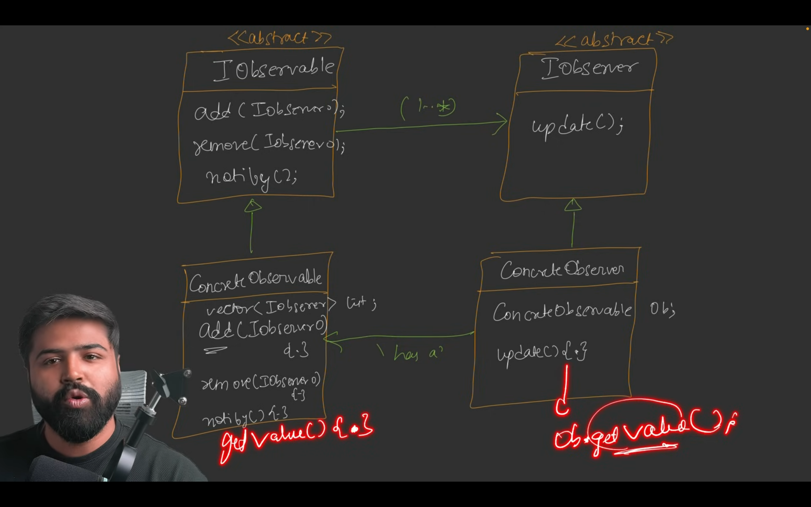

# Observer Design Pattern

Defines a one-to-many relationship between objects (observable) and observers, allowing observers to be notified of changes in the observable's state. 

## Youtube Channel's Example Overview  [CODE](/system-design/12/ObserverDesignPattern.java)
This examples demonstrates the **Observer Design Pattern** in Java, simulating a YouTube-like channel subscription system. The Observer pattern is a behavioral design pattern where a subject (e.g., a YouTube channel) maintains a list of observers (e.g., subscribers) and notifies them of state changes, such as new video uploads. This implementation follows the pattern to ensure loose coupling between the subject and its observers, allowing for extensibility and flexibility.

## Design Details
The examples includes the following key components:
- **IChannel (Subject Interface)**: Defines methods for managing subscribers (`subscribe`, `unsubscribe`) and notifying them (`notifySubscribers`).
- **Channel (Concrete Subject)**: Represents a YouTube channel that maintains a list of subscribers, allows subscription management, and notifies subscribers when a new video is uploaded.
- **ISubscriber (Observer Interface)**: Declares the `update` method that observers implement to receive notifications.
- **Subscriber (Concrete Observer)**: Represents a subscriber who receives updates about new videos from the channel they are subscribed to.
- **ObserverDesignPattern (Client)**: Demonstrates the usage by creating a channel, subscribing/unsubscribing users, and uploading videos.



### How It Works
1. A `Channel` object is created with a name (e.g., "CoderArmy").
2. `Subscriber` objects (e.g., "Varun", "Tarun") are created and subscribe to the channel.
3. When the channel uploads a video using `uploadVideo`, it calls `notifySubscribers`, which triggers the `update` method on each subscriber.
4. Subscribers receive a notification with the latest video details.
5. Subscribers can unsubscribe, and subsequent video uploads will only notify remaining subscribers.

### Key Features
- **Loose Coupling**: The `Channel` and `Subscriber` classes interact through interfaces (`IChannel`, `ISubscriber`), ensuring minimal dependency.
- **Extensibility**: New types of observers or subjects can be added by implementing the respective interfaces without modifying existing code.
- **Dynamic Subscription**: Subscribers can be added or removed at runtime, allowing flexible subscription management.
- **Event-Driven**: The pattern supports an event-driven model where state changes (new video uploads) trigger automatic updates to observers.

## Usage Example
The `ObserverDesignPattern` class demonstrates the pattern:
- A channel named "CoderArmy" is created.
- Two subscribers, Varun and Tarun, subscribe to the channel.
- A video ("Observer Pattern Tutorial") is uploaded, notifying both subscribers.
- Varun unsubscribes, and a second video ("Decorator Pattern Tutorial") is uploaded, notifying only Tarun.

### Output
```
[CoderArmy uploaded "Observer Pattern Tutorial"]
Hey Varun,
Checkout our new Video : Observer Pattern Tutorial

Hey Tarun,
Checkout our new Video : Observer Pattern Tutorial

[CoderArmy uploaded "Decorator Pattern Tutorial"]
Hey Tarun,
Checkout our new Video : Decorator Pattern Tutorial
```

## Benefits of the Observer Pattern
- **Scalability**: Easily supports adding new subscribers or channels without modifying existing code.
- **Flexibility**: Observers can be dynamically added or removed, making the system adaptable to runtime changes.
- **Reusability**: The pattern can be applied to other scenarios, such as news feeds, event handling, or publish-subscribe systems.
- **Maintainability**: Clear separation of concerns between subjects and observers simplifies debugging and testing.

## Conclusion
This implementation of the Observer Design Pattern provides a clean, modular, and extensible solution for a subscription-based system. It adheres to object-oriented principles, ensuring that the subject and observers are loosely coupled and can evolve independently. The pattern is ideal for scenarios where multiple objects need to react to state changes in a single object, as demonstrated by the YouTube channel example.
