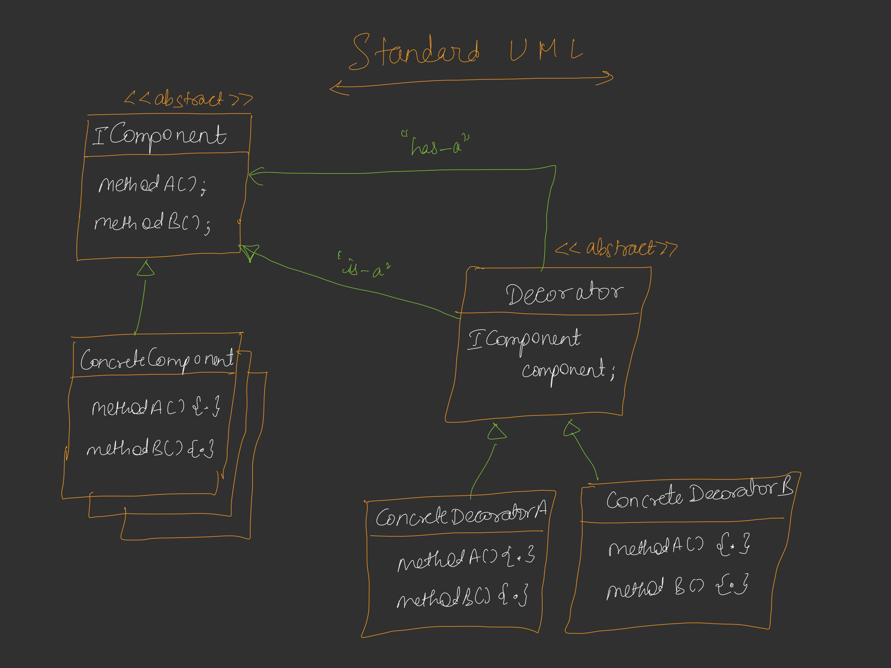

# Decorator Design Pattern

## Definition
The **Decorator Design Pattern** is a structural pattern that allows behavior to be added to an object dynamically by wrapping it with decorator objects. It follows the "is-a" and "has-a" relationship, enabling flexible extension of an object's functionality without modifying its code.



## Example Overview [Code](/system-design/13/DecoratorPattern.java)
This project demonstrates the **Decorator Design Pattern** in Java, simulating power-ups for a Mario character in a game. The pattern allows Mario to gain abilities (e.g., height increase, gun, star power) dynamically by wrapping the base `Mario` object with decorator classes.

## Design Details
The example includes the following key components:
- **Character (Component Interface)**: Defines the `getAbilities` method for Mario and decorators.
- **Mario (Concrete Component)**: Represents the basic Mario character with no power-ups.
- **CharacterDecorator (Abstract Decorator)**: Implements `Character` and holds a reference to a `Character` object for wrapping.
- **HeightUp (Concrete Decorator)**: Adds a height-increasing ability to Mario.
- **GunPowerUp (Concrete Decorator)**: Adds a gun-shooting ability to Mario.
- **StarPowerUp (Concrete Decorator)**: Adds a temporary star power ability to Mario.
- **DecoratorPattern (Client)**: Demonstrates the usage by applying power-ups to Mario.

### How It Works
1. A `Mario` object is created with basic abilities.
2. Decorators (`HeightUp`, `GunPowerUp`, `StarPowerUp`) wrap the `Mario` object, adding new abilities.
3. Each decorator calls the wrapped object's `getAbilities` method and appends its own ability.
4. The client (`DecoratorPattern`) applies multiple decorators in sequence, stacking abilities.

### Key Features
- **Dynamic Behavior Addition**: Power-ups are added at runtime without modifying the `Mario` class.
- **Flexible Composition**: Multiple decorators can be stacked in any order (e.g., HeightUp → GunPowerUp → StarPowerUp).
- **Open-Closed Principle**: New power-ups can be added by creating new decorators without altering existing code.

## Usage Example
The `DecoratorPattern` class demonstrates the pattern:
- A basic `Mario` object is created.
- Mario gains `HeightUp`, then `GunPowerUp`, and finally `StarPowerUp` abilities.

### Output
```
Basic Character: Mario
After HeightUp: Mario with HeightUp
After GunPowerUp: Mario with HeightUp with Gun
After StarPowerUp: Mario with HeightUp with Gun with Star Power (Limited Time)
```

## Benefits of the Decorator Pattern
- **Extensibility**: Easily add new power-ups by creating new decorator classes.
- **Flexibility**: Combine abilities in any order at runtime.
- **Maintainability**: Avoids modifying the core `Mario` class, adhering to the Open-Closed Principle.
- **Reusability**: Decorators can be reused across different characters or contexts.

## Conclusion
This implementation of the Decorator Design Pattern provides a flexible and modular solution for adding dynamic abilities to a character like Mario. It showcases how the pattern enables runtime behavior extension while maintaining clean, maintainable code.
