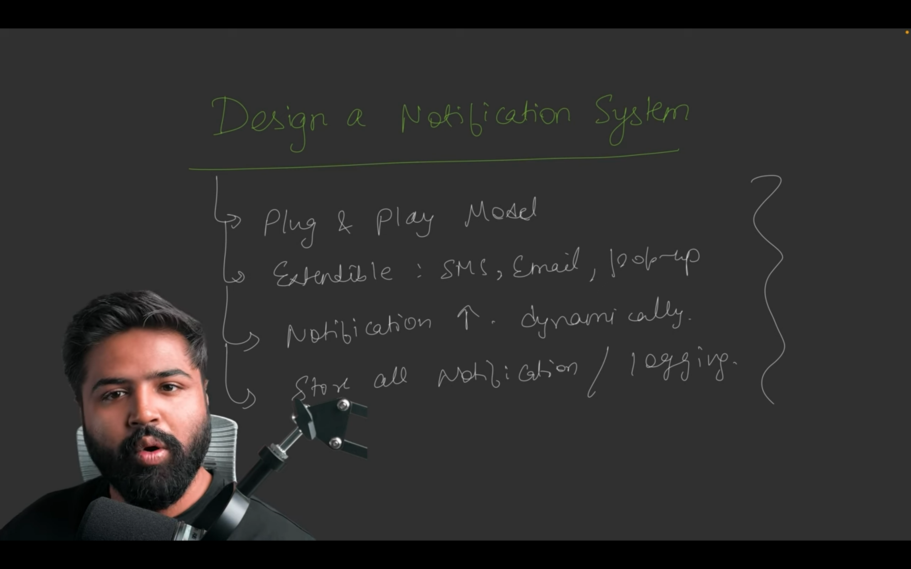
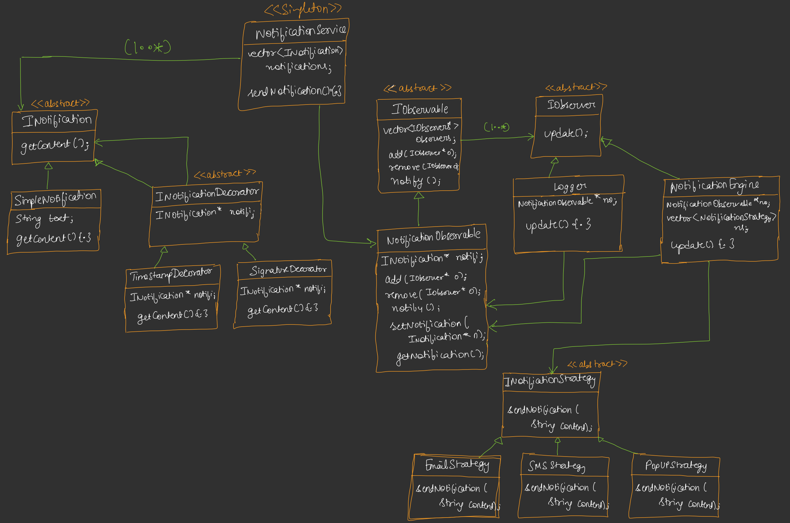

# Notification System - Design Patterns Implementation

## Overview
This project implements a **Notification System** in Java, integrating multiple design patterns: **Decorator**, **Observer**, **Strategy**, and **Singleton**. It simulates a system where notifications are created, decorated, logged, and sent to users via different channels (e.g., email, SMS, pop-up).





## Design Details
The system includes the following components:

### Notification & Decorators (Decorator Pattern)
- **INotification (Interface)**: Defines the `getContent` method for notifications.
- **SimpleNotification (Concrete Notification)**: A basic notification with a text message.
- **INotificationDecorator (Abstract Decorator)**: Wraps an `INotification` to add features.
- **TimestampDecorator**: Adds a timestamp to the notification content.
- **SignatureDecorator**: Appends a signature to the notification content.

### Observer Pattern Components
- **IObserver (Interface)**: Defines the `update` method for observers.
- **IObservable (Interface)**: Defines methods to manage observers (`addObserver`, `removeObserver`, `notifyObservers`).
- **NotificationObservable (Concrete Observable)**: Manages a list of observers and notifies them of new notifications.
- **Logger (Concrete Observer)**: Logs notifications to the console. Automatically attaches to the `NotificationService`'s observable during instantiation in the updated version.
- **NotificationEngine (Concrete Observer)**: Sends notifications via multiple strategies. Automatically attaches to the `NotificationService`'s observable during instantiation in the updated version.

### Strategy Pattern Components (Integrated with Observer)
- **INotificationStrategy (Interface)**: Defines the `sendNotification` method for sending notifications.
- **EmailStrategy**: Sends notifications via email.
- **SMSStrategy**: Sends notifications via SMS.
- **PopUpStrategy**: Sends notifications as pop-ups.
- **NotificationEngine**: Uses a list of strategies to send notifications to users.

### Notification Service (Singleton Pattern)
- **NotificationService (Singleton)**: Manages notifications and exposes a `NotificationObservable` for observers to attach. Ensures a single instance using the Singleton pattern.

### How It Works
1. **Notification Creation**: A `SimpleNotification` is created and decorated with `TimestampDecorator` and `SignatureDecorator`.
2. **Notification Service**: The `NotificationService` (Singleton) receives the notification and updates the `NotificationObservable`.
3. **Observer Setup (Updated)**: `Logger` and `NotificationEngine` observers automatically attach to the `NotificationService`'s observable during their instantiation.
4. **Observer Notification**: The `NotificationObservable` notifies attached observers (`Logger`, `NotificationEngine`).
5. **Logging**: The `Logger` observer logs the notification content to the console.
6. **Notification Sending**: The `NotificationEngine` observer uses multiple strategies (Email, SMS, Pop-up) to send the notification.

### Key Features
- **Decorator Pattern**: Dynamically adds features (timestamp, signature) to notifications.
- **Observer Pattern**: Enables automatic updates to observers (logging, sending notifications) when a new notification is created.
- **Strategy Pattern**: Allows flexible notification delivery via multiple channels (Email, SMS, Pop-up).
- **Singleton Pattern**: Ensures a single `NotificationService` instance manages the system.
- **Automatic Observer Attachment (Updated)**: `Logger` and `NotificationEngine` automatically register with the `NotificationService`'s observable upon creation, simplifying setup.

## Usage Example
The `NotificationSystemUpdated` class demonstrates the system:
- A `SimpleNotification` is created with the message "Your order has been shipped!".
- It is decorated with a timestamp and signature.
- The `NotificationService` sends the notification, triggering the `Logger` and `NotificationEngine` to log and send it via Email, SMS, and Pop-up.

### Output
```
Logging New Notification : 
[2025-04-13 14:22:00] Your order has been shipped!
-- Customer Care


Sending email Notification to: random.person@gmail.com
[2025-04-13 14:22:00] Your order has been shipped!
-- Customer Care


Sending SMS Notification to: +91 9876543210
[2025-04-13 14:22:00] Your order has been shipped!
-- Customer Care


Sending Popup Notification: 
[2025-04-13 14:22:00] Your order has been shipped!
-- Customer Care

```

## Benefits
- **Extensibility**: Easily add new decorators, strategies, or observers without modifying existing code.
- **Flexibility**: Notifications can be sent via multiple channels using the Strategy pattern.
- **Scalability**: The Observer pattern supports adding new observers dynamically.
- **Centralized Management**: The Singleton pattern ensures a single point of control for notifications.
- **Simplified Setup (Updated)**: Automatic observer attachment reduces manual configuration.

## Conclusion
This Notification System showcases the power of combining multiple design patterns (Decorator, Observer, Strategy, Singleton) to create a flexible, scalable, and maintainable system. The updated version simplifies observer setup, making the system more efficient and easier to use.
