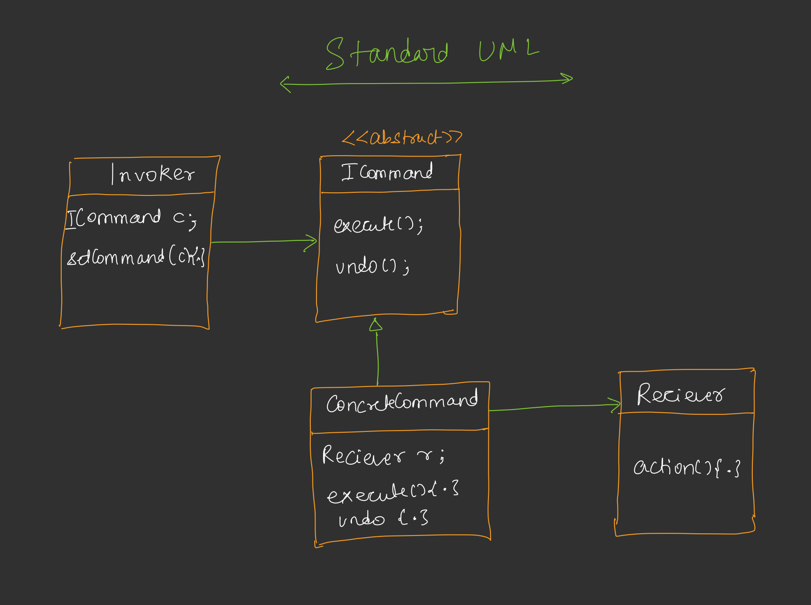
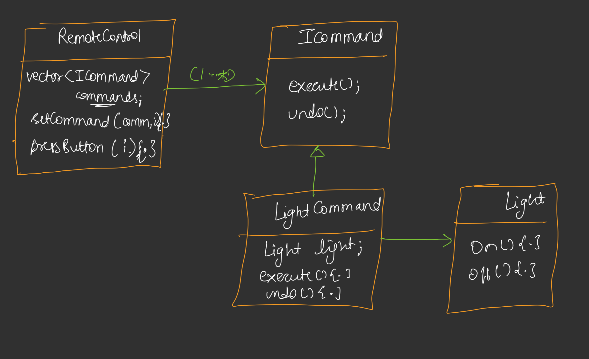

# Command Design Pattern

## Definition
The Command Design Pattern is a behavioral design pattern that encapsulates a request as an object, thereby allowing for parameterization of clients with different requests, queuing or logging of requests, and support for undoable operations. It decouples the sender (invoker) of a request from the object that performs the action (receiver).



## Purpose
- To encapsulate all information about a request into a single object.
- To allow flexible handling of requests, such as queuing, logging, or undoing operations.
- To decouple the object that invokes the operation from the one that knows how to perform it.

## Components
1. **Command Interface**: Declares methods for executing and undoing a command (e.g., `execute()`, `undo()`).
2. **Concrete Command**: Implements the Command interface, defining the binding between a receiver and an action.
3. **Receiver**: Knows how to perform the operations associated with a request (e.g., `Light`, `Fan`).
4. **Invoker**: Initiates the command execution and may track command history (e.g., `RemoteController`).
5. **Client**: Creates concrete commands and assigns them to the invoker.

## Implementation [Code](/system-design/15/CommandPattern.java)
The provided Java code demonstrates the Command Pattern with a `RemoteController` controlling devices like `Light` and `Fan`. Each button on the remote can be assigned a command, and pressing a button toggles between executing and undoing the command.



### Key Features
- **Toggle Behavior**: The `RemoteController` tracks the state of each button (`buttonPressed`) to toggle between `execute()` (e.g., turn on) and `undo()` (e.g., turn off).
- **Extensibility**: New devices and commands (e.g., `TVCommand`) can be added without modifying existing code.
- **Error Handling**: Unassigned buttons display a message when pressed.

## Usage
Run the `CommandPattern` class to simulate a remote control with four buttons, two assigned to control a `Light` and a `Fan`. The program demonstrates toggling devices on and off and handling unassigned buttons.

### Example Output
```
--- Toggling Light Button 0 ---
Light is ON
Light is OFF
--- Toggling Fan Button 1 ---
Fan is ON
Fan is OFF
--- Pressing Unassigned Button 2 ---
No command assigned at button 2
```

## Benefits
- **Decoupling**: Separates the invoker from the receiver, allowing independent changes.
- **Undo/Redo**: Easily supports undoable operations.
- **Extensibility**: New commands can be added without altering existing code.
- **Flexibility**: Commands can be queued, logged, or parameterized.

## Limitations
- **Increased Complexity**: Introduces additional classes, which may complicate simple applications.
- **Memory Overhead**: Storing command objects for undo/redo functionality can consume memory.

## Use Cases
- Remote control systems (as shown in the example).
- GUI applications for button actions or menu commands.
- Transaction systems requiring undo/redo (e.g., text editors).
- Task scheduling or queuing systems.

