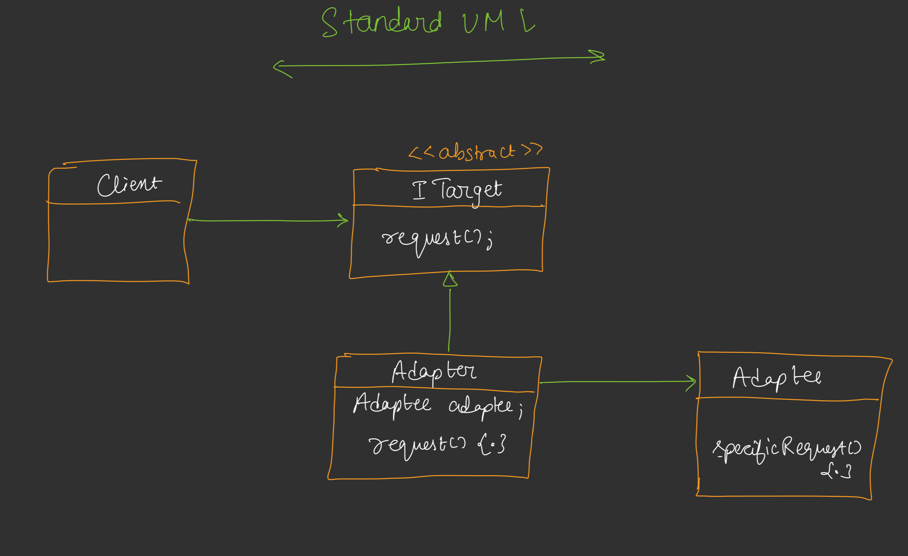
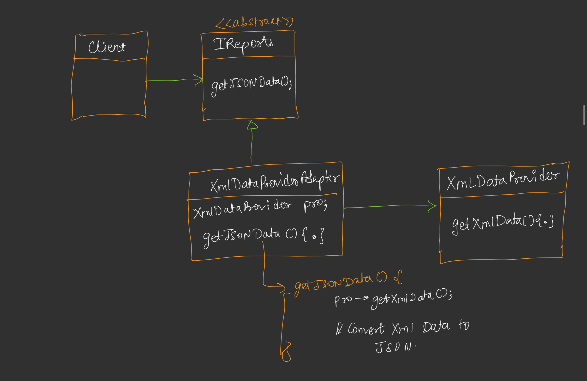

# Adapter Design Pattern

## Definition
The Adapter Design Pattern is a structural design pattern that allows incompatible interfaces to work together. It acts as a bridge between two incompatible interfaces by converting the interface of a class into another interface that a client expects.



## Purpose
- To enable a class with an incompatible interface to work with a client that expects a different interface.
- To reuse existing classes without modifying their code.
- To provide a unified interface for different data formats or systems.

## Example Scenario


In this example, a client expects to receive data in JSON format through the `IReports` interface. However, the existing `XmlDataProvider` class provides data in XML format. The `XmlDataProviderAdapter` acts as an adapter that converts the XML data into JSON format, allowing the client to work seamlessly with the existing XML provider.

## Components
1. **Target Interface**: The interface expected by the client (e.g., `IReports` with `getJsonData`).
2. **Adaptee**: The existing class with an incompatible interface (e.g., `XmlDataProvider` providing XML data).
3. **Adapter**: Implements the target interface and translates calls to the adaptee’s interface (e.g., `XmlDataProviderAdapter` converts XML to JSON).
4. **Client**: Interacts with the target interface, unaware of the adaptee (e.g., `Client` class).

## Implementation [Code](/system-design/16/AdapterPattern.java)
The provided Java code demonstrates the Adapter Pattern with a client that expects JSON data through the `IReports` interface, while the `XmlDataProvider` provides XML data. The `XmlDataProviderAdapter` converts the XML output to JSON to meet the client’s expectations.

### Key Features
- **Data Conversion**: The adapter parses XML output from `XmlDataProvider` and reformats it as JSON.
- **Seamless Integration**: The client interacts only with the `IReports` interface, unaware of the XML-to-JSON conversion.
- **Simple Parsing**: The adapter naïvely extracts data from XML tags to build JSON, assuming a fixed XML structure.

## Usage
Run the `AdapterPattern` class to simulate a client processing raw data ("name:id" format, e.g., "Alice:42"). The adapter converts the XML output from `XmlDataProvider` to JSON, which the client then displays.

### Example Output
```
Processed JSON: {"name":"Alice", "id":42}
```

## Benefits
- **Reusability**: Allows reuse of existing classes with incompatible interfaces.
- **Flexibility**: Enables integration of new systems without modifying client or adaptee code.
- **Transparency**: The client interacts with a consistent interface, unaware of the adaptation process.

## Limitations
- **Performance Overhead**: Additional processing (e.g., XML-to-JSON conversion) may introduce slight delays.
- **Complexity**: Adds an extra layer of abstraction, which may complicate simple integrations.
- **Assumes Stable Adaptee**: The adapter relies on a consistent adaptee output format (e.g., fixed XML structure).

## Use Cases
- Integrating legacy systems with modern APIs (e.g., converting XML to JSON for web services).
- Adapting third-party libraries to match application interfaces.
- Supporting multiple data formats in a client application.

