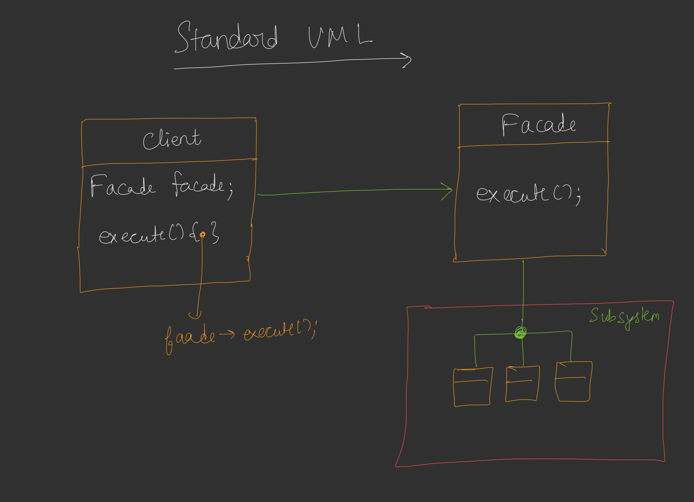
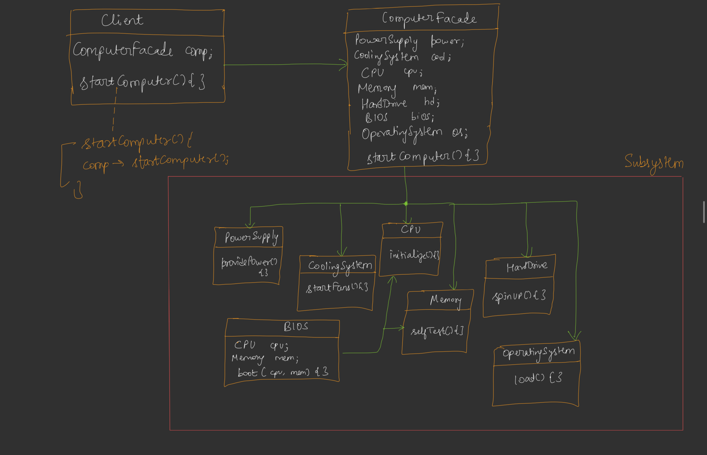

# Facade Design Pattern

## Definition
The Facade Design Pattern is a structural design pattern that provides a simplified interface to a complex subsystem. It hides the complexities of the subsystem and offers a single, unified interface for the client to interact with, making the subsystem easier to use.



## Purpose
- To provide a simple interface to a complex set of classes or subsystems.
- To reduce coupling between clients and subsystem components.
- To promote ease of use by hiding implementation details of the subsystem.

## Example Scenario



In this example, we simulate a computer booting process. The `ComputerFacade` class provides a simple interface to start the computer, while the underlying subsystem classes (`PowerSupply`, `CoolingSystem`, `CPU`, `Memory`, `HardDrive`, `BIOS`, `OperatingSystem`) handle the complex operations involved in booting a computer.

## Components
1. **Subsystem Classes**: Individual classes that perform specific tasks within the subsystem (e.g., `PowerSupply`, `CoolingSystem`, `CPU`, `Memory`, `HardDrive`, `BIOS`, `OperatingSystem`).
2. **Facade**: A class that provides a simplified interface to the client, coordinating calls to the subsystem classes (e.g., `ComputerFacade`).
3. **Client**: Interacts with the facade to perform high-level operations without needing to understand the subsystem’s complexity.

## Implementation [Code](/system-design/17/FacadePattern.java)

The provided Java code demonstrates the Facade Pattern with a `ComputerFacade` that simplifies the process of starting a computer. The facade coordinates the interactions between various subsystem components (`PowerSupply`, `CoolingSystem`, `CPU`, `Memory`, `HardDrive`, `BIOS`, `OperatingSystem`) to boot the system.

### Key Features
- **Simplified Interface**: The `ComputerFacade` exposes a single `startComputer()` method to handle the entire boot process.
- **Encapsulation**: The client is unaware of the subsystem’s internal workings and only interacts with the facade.
- **Coordination**: The facade orchestrates the sequence of subsystem operations in the correct order (e.g., powering on before booting).

## Usage
Run the `FacadePattern` class to simulate starting a computer. The `ComputerFacade` manages the boot process by invoking methods on the subsystem components in the correct order, producing a clear sequence of actions.

### Example Output
```
----- Starting Computer -----
Power Supply: Providing power...
Cooling System: Fans started...
BIOS: Booting CPU and Memory checks...
CPU: Initialization started...
Memory: Self-test passed...
Hard Drive: Spinning up...
Operating System: Loading into memory...
Computer Booted Successfully!
```

## Benefits
- **Simplicity**: Reduces the complexity of interacting with multiple subsystem components.
- **Decoupling**: Minimizes dependencies between the client and subsystem, improving maintainability.
- **Ease of Use**: Provides a single entry point for complex operations, making the system more user-friendly.

## Limitations
- **Limited Flexibility**: The facade may not expose all subsystem functionality, restricting advanced use cases.
- **Potential Bottleneck**: The facade can become a monolithic class if it handles too many subsystem interactions.
- **Maintenance Overhead**: Changes to the subsystem may require updates to the facade.

## Use Cases
- Simplifying complex APIs or libraries (e.g., a facade for a multimedia framework).
- Managing hardware initialization processes (as shown in the example).
- Providing a unified interface for interacting with multiple services in a microservices architecture.

