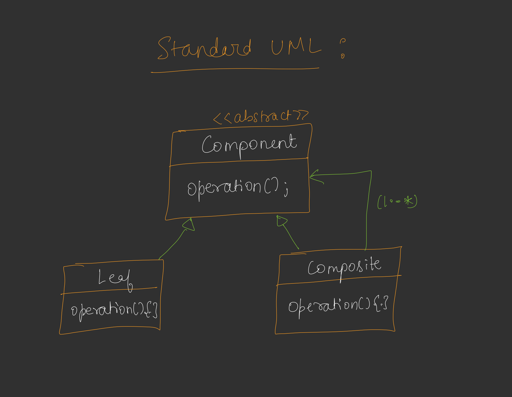
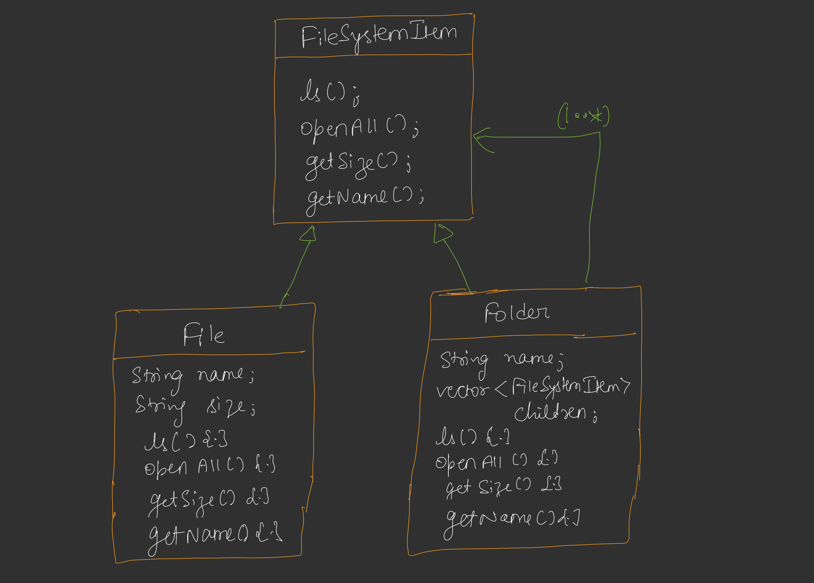

# Composite Design Pattern

## Definition
The Composite Design Pattern is a structural design pattern that allows you to compose objects into tree structures to represent part-whole hierarchies. It lets clients treat individual objects (leaves) and compositions of objects (composites) uniformly through a common interface.



## Purpose
- To represent hierarchical structures (e.g., a file system with files and folders) in a unified way.
- To enable clients to work with both individual objects and compositions without distinguishing between them.
- To simplify operations on complex tree structures by applying the same method to both leaves and composites.

## Example Scenario - LLD Of File System



This example illustrates a file system where files and folders are treated uniformly. The `FileSystemItem` interface defines methods applicable to both files and folders, allowing operations like listing contents, opening files, and calculating sizes to be performed recursively.

## Components
1. **Component Interface**: Defines the common interface for both leaf and composite objects (e.g., `FileSystemItem` with methods like `ls`, `openAll`, `getSize`, `cd`).
2. **Leaf**: Represents individual objects in the hierarchy (e.g., `File` for a single file).
3. **Composite**: Represents a container that can hold other leaves or composites (e.g., `Folder` containing files and subfolders).
4. **Client**: Interacts with the hierarchy through the component interface.

## Implementation [Code](/system-design/19/CompositePattern.java)

The provided Java code demonstrates the Composite Pattern with a file system structure. The `FileSystemItem` interface is implemented by both `File` (leaf) and `Folder` (composite). A `Folder` can contain multiple `FileSystemItem` objects (files or subfolders), and operations like listing (`ls`), opening (`openAll`), and calculating size (`getSize`) are applied recursively.

### Key Features
- **Uniform Interface**: Both `File` and `Folder` implement the same `FileSystemItem` interface, allowing consistent method calls.
- **Recursive Operations**: Methods like `ls` and `openAll` traverse the hierarchy recursively for folders.
- **Navigation Support**: The `cd` method allows navigation into subfolders, returning `null` for files or if the target is not found.
- **Hierarchy Visualization**: `ls` indents to show structure, and `openAll` displays the full tree with indentation.

## Usage
Run the `CompositePattern` class to simulate a file system. The program creates a hierarchy with a `root` folder containing files and subfolders (`docs`, `images`), then demonstrates listing contents, opening the hierarchy, navigating with `cd`, and calculating total size.

### Example Output
```
file1.txt
file2.txt
+ docs
+ images

resume.pdf
notes.txt

+ root
    file1.txt
    file2.txt
    + docs
        resume.pdf
        notes.txt
    + images
        photo.jpg

resume.pdf
notes.txt

5
```

## Benefits
- **Uniformity**: Clients can treat files and folders the same way, simplifying code.
- **Scalability**: Easily add new files or folders to the hierarchy without changing client code.
- **Recursive Operations**: Operations like calculating size or listing contents are naturally recursive, fitting hierarchical structures.

## Limitations
- **Performance Overhead**: Recursive operations can be slow for very deep or large hierarchies.
- **Limited Flexibility**: The uniform interface may force methods (e.g., `cd`) to be implemented in leaves, even if they don’t apply (returning `null`).
- **Complexity**: Managing a dynamic hierarchy can introduce complexity in larger systems.

## Use Cases
- File system implementations (as shown in the example).
- GUI frameworks for managing nested components (e.g., panels containing buttons or other panels).
- Organizational structures (e.g., representing departments and employees in a company).

