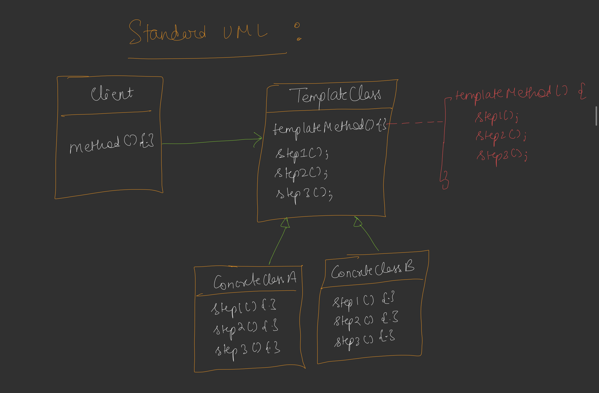

# Template Method Design Pattern

## Definition
The Template Method Design Pattern is a behavioral design pattern that defines the skeleton of an algorithm in a base class, allowing subclasses to override specific steps without changing the algorithm's overall structure. It ensures a consistent sequence of steps while providing flexibility for implementation details.



## Purpose
- To define a fixed algorithm structure while allowing subclasses to customize specific steps.
- To avoid code duplication by centralizing common behavior in the base class.
- To ensure that the algorithm's sequence remains consistent across implementations.

## Example Scenario
In this example, we implement a machine learning model training pipeline using the Template Method Pattern. The base class `ModelTrainer` defines the overall training process, while subclasses like `NeuralNetworkTrainer` and `DecisionTreeTrainer` implement specific training and evaluation logic.
## Components
1. **Abstract Class**: Defines the template method (e.g., `trainPipeline` in `ModelTrainer`) and common steps, with abstract methods for steps that subclasses must implement.
2. **Template Method**: A `final` method in the base class that outlines the algorithm's sequence (e.g., `trainPipeline`).
3. **Concrete Classes**: Subclasses that implement the abstract steps and may override default methods (e.g., `NeuralNetworkTrainer`, `DecisionTreeTrainer`).
4. **Client**: Invokes the template method to execute the algorithm.

## Implementation [Code](/system-design/20/TemplateMethodPattern.java)

The provided Java code demonstrates the Template Method Pattern with a machine learning model training pipeline. The `ModelTrainer` abstract class defines a fixed `trainPipeline` method that sequences steps: loading data, preprocessing, training, evaluating, and saving the model. Subclasses like `NeuralNetworkTrainer` and `DecisionTreeTrainer` provide specific implementations for training and evaluation, with `NeuralNetworkTrainer` also overriding the default `saveModel` method.

### Key Features
- **Fixed Sequence**: The `trainPipeline` method is `final`, ensuring subclasses cannot alter the order of steps.
- **Shared Logic**: Common steps like `loadData` and `preprocessData` are implemented in the base class.
- **Customizable Steps**: Subclasses must implement `trainModel` and `evaluateModel`, and can optionally override `saveModel`.
- **Extensibility**: New model types (e.g., SVM, Random Forest) can be added by creating new subclasses.

## Usage
Run the `TemplateMethodPattern` class to simulate training two models: a neural network and a decision tree. The program executes the `trainPipeline` for each, showing how the same algorithm structure is applied with model-specific implementations.

### Example Output
```
=== Neural Network Training ===
[Common] Loading dataset from data/images/
[Common] Splitting into train/test and normalizing
[NeuralNet] Training Neural Network for 100 epochs
[NeuralNet] Evaluating accuracy and loss on validation set
[NeuralNet] Serializing network weights to .h5 file

=== Decision Tree Training ===
[Common] Loading dataset from data/iris.csv
[Common] Splitting into train/test and normalizing
[DecisionTree] Building decision tree with max_depth=5
[DecisionTree] Computing classification report (precision/recall)
[Common] Saving model to disk as default format
```

## Benefits
- **Consistency**: Ensures a uniform algorithm structure across different implementations.
- **Code Reusability**: Common steps are defined once in the base class, reducing duplication.
- **Extensibility**: New subclasses can be added without modifying the base algorithm.

## Limitations
- **Rigidity**: The fixed sequence in the template method may not suit all use cases.
- **Inheritance Dependency**: Subclasses must inherit from the base class, which can limit flexibility compared to composition-based approaches.
- **Complexity**: Overuse of the pattern can lead to a deep inheritance hierarchy, making the system harder to maintain.

## Use Cases
- Workflow pipelines (as shown in the example, e.g., machine learning training).
- Game development for defining character behavior with customizable actions.
- Framework design where a fixed process needs to support variant implementations (e.g., lifecycle methods).

