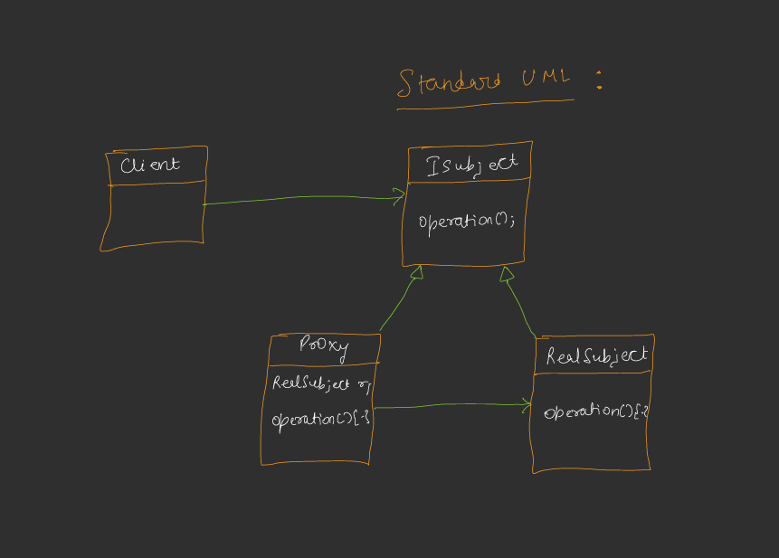
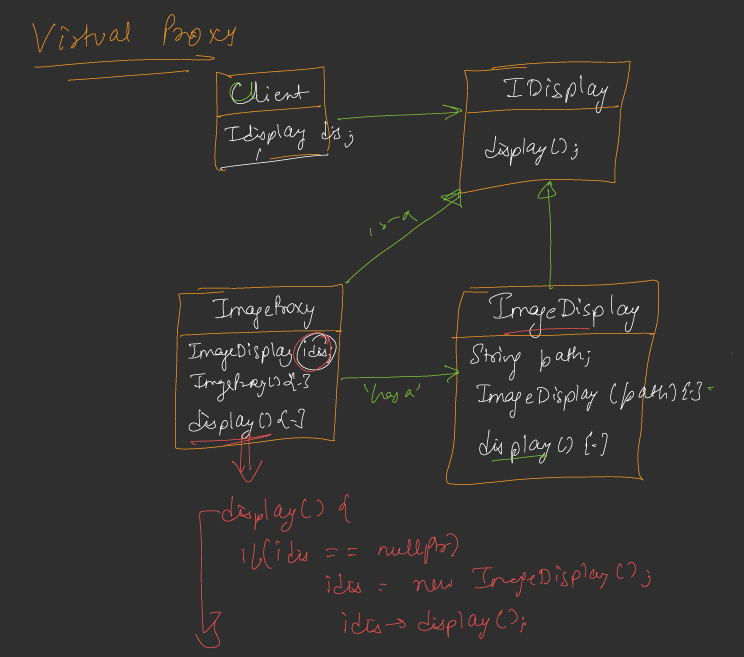
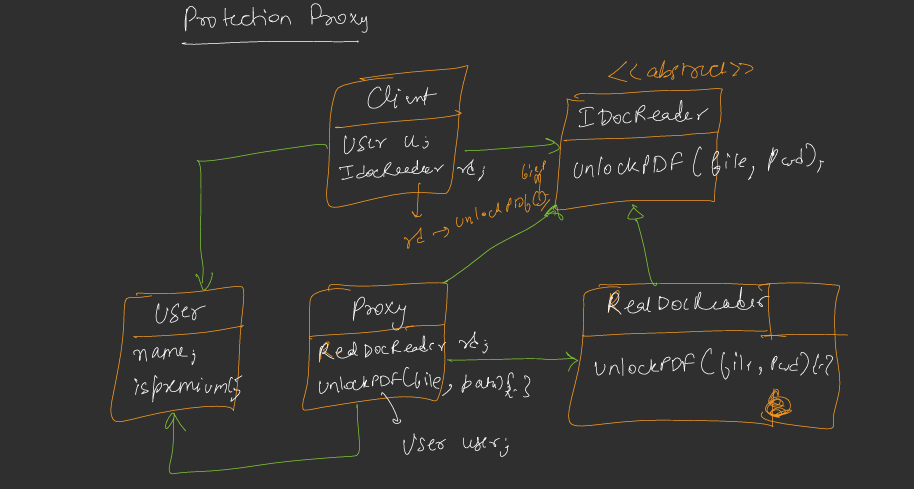
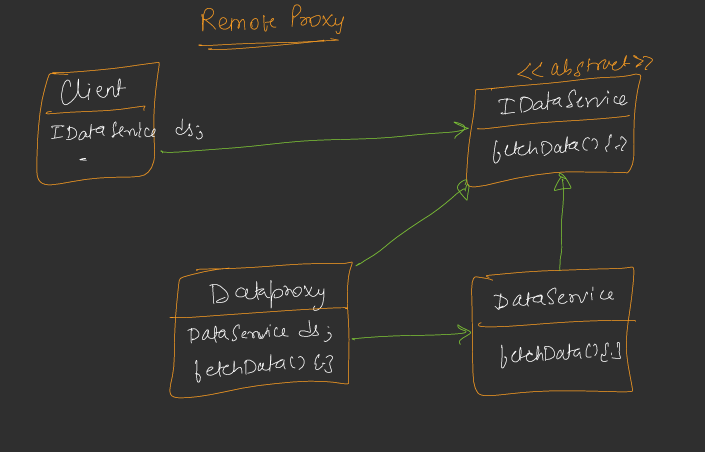

# Proxy Design Pattern

## Definition
The Proxy Design Pattern is a structural design pattern that provides a surrogate or placeholder for another object to control access to it. It allows additional functionality (e.g., lazy loading, access control, or remote communication) to be added without modifying the original object's code.



## Purpose
- To act as an intermediary between a client and a target object, adding control or functionality.
- To manage resource-intensive operations, enforce access restrictions, or handle remote interactions.
- To provide a layer of abstraction for complex operations like lazy initialization, security, or network communication.

## Types of Proxies
The code demonstrates three types of proxies: Virtual, Protection, and Remote.

### 1. Virtual Proxy  [Example Code](/system-design/21/VirtualProxy.java)



- **Purpose**: Delays the creation of a resource-intensive object until it is actually needed (lazy loading).
- **Implementation**: `ImageProxy` implements `IImage` and delays the creation of `RealImage` until the `display` method is called.
- **Use Case**: Loading large images or resources only when they are required.

### 2. Protection Proxy [Example Code](/system-design/21/ProtectionProxy.java)



- **Purpose**: Controls access to an object based on permissions or conditions.
- **Implementation**: `DocumentProxy` implements `IDocumentReader` and checks if the `User` has a premium membership before allowing access to `RealDocumentReader` to unlock a PDF.
- **Use Case**: Restricting access to sensitive operations (e.g., unlocking PDFs) based on user roles.

### 3. Remote Proxy [Example Code](/system-design/21/RemoteProxy.java)



- **Purpose**: Represents an object located in a different address space (e.g., on a remote server) and handles communication.
- **Implementation**: `DataServiceProxy` implements `IDataService` and acts as a local representative for `RealDataService`, simulating remote communication.
- **Use Case**: Accessing data from a remote server while hiding the complexity of network communication.

## Components
1. **Subject Interface**: Defines the common interface for both the proxy and the real object (e.g., `IImage`, `IDocumentReader`, `IDataService`).
2. **Real Subject**: The actual object that the proxy represents (e.g., `RealImage`, `RealDocumentReader`, `RealDataService`).
3. **Proxy**: Implements the subject interface and controls access to the real subject (e.g., `ImageProxy`, `DocumentProxy`, `DataServiceProxy`).
4. **Client**: Interacts with the subject interface, unaware of whether it’s working with a proxy or the real object.

## Implementation
The provided Java code demonstrates three proxy types:
- **Virtual Proxy (`VirtualProxy`)**: `ImageProxy` delays loading a `RealImage` until `display` is called.
- **Protection Proxy (`ProtectionProxy`)**: `DocumentProxy` restricts PDF unlocking to premium users.
- **Remote Proxy (`RemoteProxy`)**: `DataServiceProxy` simulates remote access to `RealDataService`.

### Key Features
- **Lazy Loading (Virtual)**: `ImageProxy` only loads the image when `display` is called, saving resources.
- **Access Control (Protection)**: `DocumentProxy` enforces premium membership checks before unlocking PDFs.
- **Remote Communication (Remote)**: `DataServiceProxy` abstracts the remote service interaction, adding a connection step.

## Usage
Run each class (`VirtualProxy`, `ProtectionProxy`, `RemoteProxy`) to see the respective proxy in action.

### Example Output
**Virtual Proxy**: [Example Code](/system-design/21/VirtualProxy.java)
```
[RealImage] Loading image from disk: sample.jpg
[RealImage] Displaying sample.jpg
```

**Protection Proxy**: [Example Code](/system-design/21/ProtectionProxy.java)
```
== Rohan (Non-Premium) tries to unlock PDF ==
[DocumentProxy] Access denied. Only premium members can unlock PDFs.

== Rashmi (Premium) unlocks PDF ==
[RealDocumentReader] Unlocking PDF at: protected_document.pdf
[RealDocumentReader] PDF unlocked successfully with password: secret123
[RealDocumentReader] Displaying PDF content...
```

**Remote Proxy**: [Example Code](/system-design/21/RemoteProxy.java)
```
[RealDataService] Initialized (simulating remote setup)
[DataServiceProxy] Connecting to remote service...
[RealDataService] Data from server
```

## Benefits
- **Resource Efficiency (Virtual)**: Delays expensive operations until necessary.
- **Security (Protection)**: Enforces access control without modifying the real object.
- **Abstraction (Remote)**: Hides the complexity of remote communication from the client.
- **Flexibility**: Proxies can add functionality (logging, caching, etc.) without changing the real object.

## Limitations
- **Overhead**: Proxies add an extra layer, which can introduce slight performance overhead.
- **Complexity**: Additional classes increase system complexity.
- **Maintenance**: Changes to the real object’s interface require updates to the proxy.

## Use Cases
- **Virtual Proxy**: Lazy loading of large images, videos, or database queries.
- **Protection Proxy**: Access control in document management systems or APIs.
- **Remote Proxy**: Accessing remote services (e.g., REST APIs, databases) in distributed systems.

