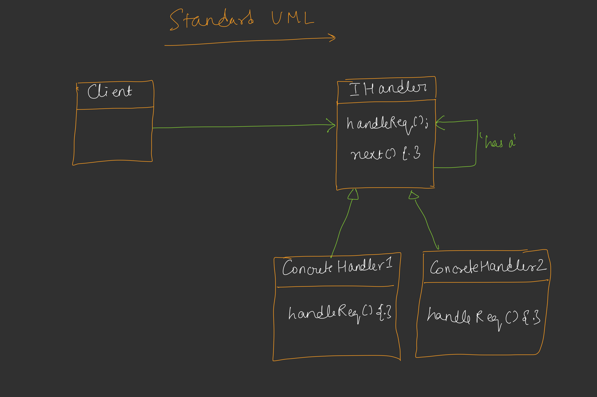

# Chain of Responsibility Design Pattern

## Definition
The Chain of Responsibility Design Pattern is a behavioral design pattern that allows a request to be passed along a chain of handlers. Each handler decides either to process the request or to pass it to the next handler in the chain, promoting loose coupling between the sender and receivers.



## Purpose
- To decouple the sender of a request from its receivers by allowing multiple objects to handle the request.
- To provide a flexible way to process requests in a sequential manner without hardcoding the handler logic.
- To enable dynamic addition or removal of handlers in the chain.

## Example Scenario
In an ATM cash dispensing system, the Chain of Responsibility Pattern can be used to handle cash withdrawal requests. Each handler in the chain represents a denomination of currency (e.g., ₹1000, ₹500, ₹200, ₹100). When a user requests a withdrawal, the request is passed through the chain of handlers until it is fully processed or no handler can fulfill the request.

## Components
1. **Handler Interface/Abstract Class**: Defines the method to handle the request and a reference to the next handler (e.g., `MoneyHandler` with `dispense` and `setNextHandler`).
2. **Concrete Handlers**: Implement the handler interface and process the request or pass it along (e.g., `ThousandHandler`, `FiveHundredHandler`, `TwoHundredHandler`, `HundredHandler`).
3. **Client**: Initiates the request and sets up the chain of handlers.

## Implementation [Code](/system-design/22/COR.java)
The provided Java code demonstrates the Chain of Responsibility Pattern with an ATM cash dispensing system. The `MoneyHandler` abstract class defines the chain structure, and concrete handlers (`ThousandHandler`, `FiveHundredHandler`, `TwoHundredHandler`, `HundredHandler`) process the withdrawal amount by dispensing notes of their denomination (₹1000, ₹500, ₹200, ₹100) and passing the remaining amount to the next handler.

### Key Features
- **Dynamic Chain**: Handlers are linked at runtime using `setNextHandler`, allowing flexible chain configuration.
- **Sequential Processing**: Each handler processes the request (dispenses notes) and forwards the remaining amount to the next handler.
- **Fallback Mechanism**: If a handler cannot fulfill the remaining amount and there’s no next handler, an "Insufficient funds" message is displayed.
- **Resource Tracking**: Each handler tracks the number of available notes and adjusts based on the request.

## Usage
Run the `COR` class to simulate an ATM dispensing cash. The program sets up a chain of handlers for denominations (₹1000 → ₹500 → ₹200 → ₹100) with a fixed number of notes and processes a withdrawal request (e.g., ₹4000).

### Example Output
```
Dispensing amount: ₹4000
Dispensing 3 x ₹1000 notes.
Dispensing 2 x ₹500 notes.
```

## Benefits
- **Decoupling**: The client doesn’t need to know which handler processes the request, reducing dependencies.
- **Flexibility**: Handlers can be added, removed, or reordered in the chain without affecting the client.
- **Single Responsibility**: Each handler focuses on a specific denomination, adhering to the Single Responsibility Principle.

## Limitations
- **No Guarantee of Handling**: If the chain is improperly configured or funds are insufficient, the request may not be fully handled.
- **Performance Overhead**: Passing the request through multiple handlers can introduce latency in large chains.
- **Debugging Complexity**: Tracking the flow of a request through the chain can be challenging in complex systems.

## Use Cases
- ATM cash dispensing systems (as shown in the example).
- Event handling systems (e.g., GUI frameworks passing events to handlers).
- Request processing pipelines (e.g., logging, authentication, or validation chains in web servers).

