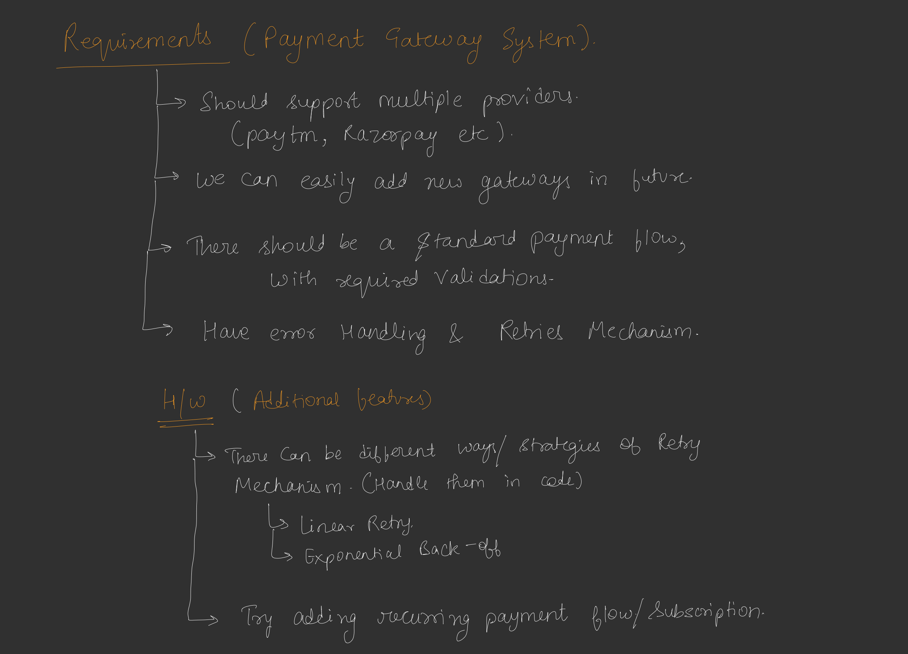
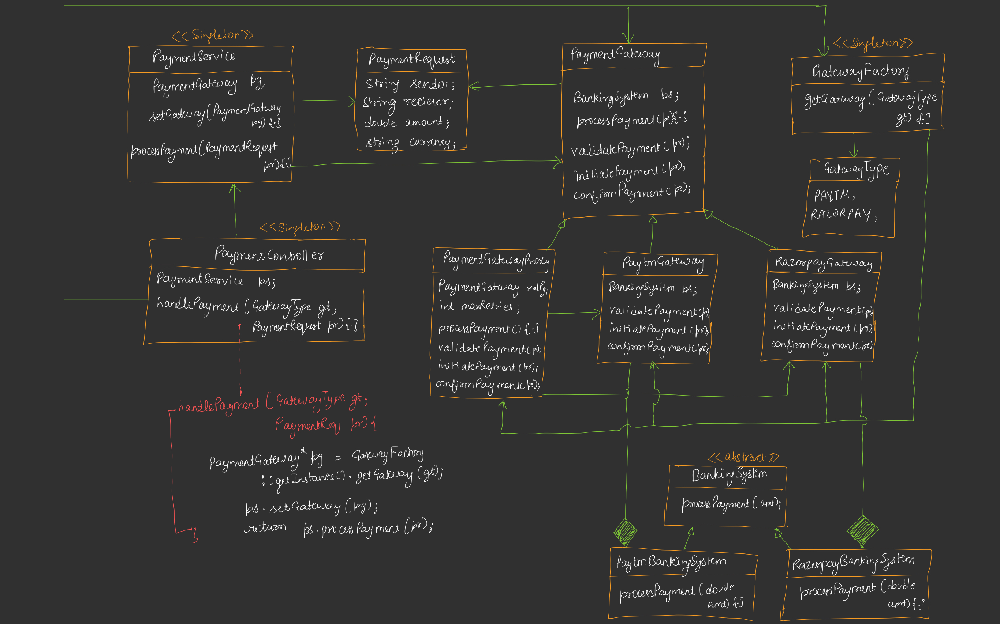

# Payment Gateway Application

## Overview
This is a Low-Level Design (LLD) implementation of a Payment Gateway system in Java. The system facilitates payment processing through different banking systems (e.g., Paytm, Razorpay) using a modular and extensible architecture. It incorporates several design patterns to ensure flexibility, scalability, and maintainability.



## Design Patterns Used



1. **Template Method Pattern**: Defines the skeleton of the payment processing algorithm in the `PaymentGateway` abstract class, allowing subclasses (`PaytmGateway`, `RazorpayGateway`) to implement specific steps (validation, initiation, confirmation).
2. **Strategy Pattern**: Implements different banking systems (`PaytmBankingSystem`, `RazorpayBankingSystem`) through the `BankingSystem` interface, allowing interchangeable payment processing logic.
3. **Proxy Pattern**: Adds retry logic to payment processing via the `PaymentGatewayProxy` class, wrapping the actual payment gateway.
4. **Singleton Pattern**: Ensures single instances of `GatewayFactory`, `PaymentService`, and `PaymentController` to manage global access and configuration.
5. **Factory Pattern**: Encapsulates the creation of payment gateways in the `GatewayFactory`, returning appropriate gateway instances based on the `GatewayType`.

## Components
### 1. Data Structure
- **PaymentRequest**: Represents a payment request with fields for sender, receiver, amount, and currency.
  ```java
  class PaymentRequest {
      public String sender;
      public String reciever;
      public double amount;
      public String currency;
  }
  ```

### 2. Banking System
- **Interface**: `BankingSystem` defines the contract for payment processing.
- **Implementations**:
  - `PaytmBankingSystem`: Simulates payment processing with an 80% success rate.
  - `RazorpayBankingSystem`: Simulates payment processing with a 90% success rate.

### 3. Payment Gateway
- **Abstract Class**: `PaymentGateway` provides a template method `processPayment` that orchestrates the payment flow (validate, initiate, confirm).
- **Concrete Classes**:
  - `PaytmGateway`: Validates payments for INR currency and processes via `PaytmBankingSystem`.
  - `RazorpayGateway`: Validates non-zero amounts and processes via `RazorpayBankingSystem`.

### 4. Proxy
- **PaymentGatewayProxy**: Wraps a `PaymentGateway` to add retry logic for failed payments. Configurable retry counts (e.g., 3 for Paytm, 1 for Razorpay).

### 5. Factory
- **GatewayFactory**: Singleton class that creates and returns a `PaymentGateway` instance wrapped in a `PaymentGatewayProxy` based on the specified `GatewayType` (PAYTM or RAZORPAY).

### 6. Service Layer
- **PaymentService**: Singleton class that holds the selected `PaymentGateway` and processes payment requests.

### 7. Controller
- **PaymentController**: Singleton class that serves as the entry point for client requests, coordinating with `GatewayFactory` and `PaymentService` to handle payments.

## How It Works
1. The client creates a `PaymentRequest` with sender, receiver, amount, and currency details.
2. The client calls `PaymentController.handlePayment`, specifying the `GatewayType` (PAYTM or RAZORPAY) and the `PaymentRequest`.
3. The `GatewayFactory` creates the appropriate `PaymentGateway` wrapped in a `PaymentGatewayProxy`.
4. The `PaymentService` uses the selected gateway to process the payment, following the steps defined in the `PaymentGateway` template method.
5. The `PaymentGatewayProxy` retries the payment if it fails, up to the configured number of attempts.
6. The result (SUCCESS or FAIL) is returned to the client.

## Execution Flow
- **Main Class**: `PaymentGatewayApplication` demonstrates the system with two sample payment requests:
  - A Paytm payment (INR, with retries).
  - A Razorpay payment (USD, with no retries).
- Output includes logs for each step (validation, initiation, confirmation, and retries) and the final result.

## Sample Output
```
Processing via Paytm
------------------------------
[Paytm] Validating payment for Aditya.
[Paytm] Initiating payment of 1000.0 INR for Aditya.
[Paytm] Confirming payment for Aditya.
Result: SUCCESS
------------------------------

Processing via Razorpay
------------------------------
[Razorpay] Validating payment for Shubham.
[Razorpay] Initiating payment of 500.0 USD for Shubham.
[BankingSystem-Razorpay] Processing payment of 500.0...
[Razorpay] Confirming payment for Shubham.
Result: SUCCESS
------------------------------
```

## Key Features
- **Modularity**: Easily extendable to support new banking systems or gateways by implementing `BankingSystem` or extending `PaymentGateway`.
- **Retry Mechanism**: Configurable retries for failed payments via the proxy.
- **Currency Validation**: Paytm enforces INR, while Razorpay allows any currency.
- **Simulated Success Rates**: Paytm (80%), Razorpay (90%) for realistic testing.
- **Centralized Control**: Singleton `PaymentController` simplifies client interaction.

## Usage
1. Create a `PaymentRequest` with appropriate details.
2. Use `PaymentController.getInstance().handlePayment(GatewayType, PaymentRequest)` to process payments.
3. Check the returned boolean to determine success or failure.

## Extensibility
- Add new gateways by creating a new class extending `PaymentGateway` and updating `GatewayFactory`.
- Add new banking systems by implementing `BankingSystem`.
- Modify retry logic in `PaymentGatewayProxy` or add additional features like logging or metrics.

## Limitations
- Simulated banking systems use random success rates for demonstration.
- No real banking integration or error handling for network issues.
- Currency conversion or advanced validation logic is not implemented.

## Prerequisites
- Java 8 or higher.

## Running the Application
1. Compile and run `PaymentGatewayApplication.java`.
2. Observe the console output for payment processing logs and results.

This design provides a robust foundation for a payment gateway system, balancing simplicity with flexibility for future enhancements.