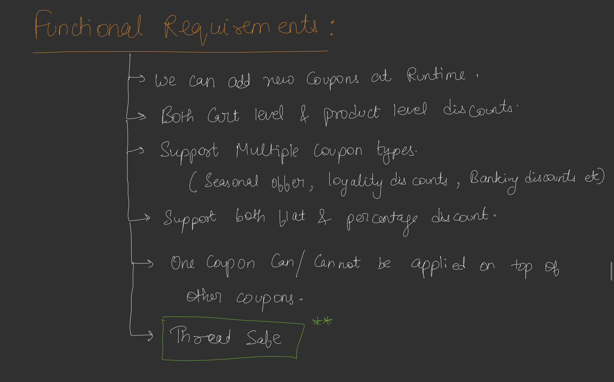
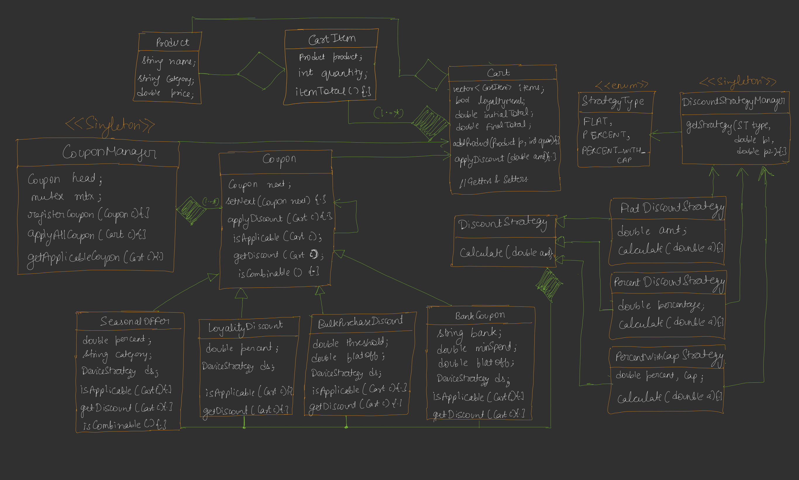

# Discount Coupon System

This Java application implements a flexible discount coupon system for an e-commerce shopping cart using design patterns such as Strategy, Singleton, and Chain of Responsibility.

## Overview

The system allows for multiple discount strategies and coupons to be applied to a shopping cart based on various conditions (e.g., product category, loyalty status, payment method, or bulk purchase). Discounts are calculated dynamically and applied in a chain, with support for combinable and non-combinable coupons.





## Design Patterns Used

- **Strategy Pattern**: Implements different discount calculation strategies (`FlatDiscountStrategy`, `PercentageDiscountStrategy`, `PercentageWithCapStrategy`) via the `DiscountStrategy` interface.
- **Singleton Pattern**: Ensures single instances of `DiscountStrategyManager` and `CouponManager` for centralized management.
- **Chain of Responsibility Pattern**: Manages coupon application through a chain of `Coupon` objects, where each coupon checks applicability and applies its discount before passing control to the next coupon.

## Key Components

### 1. Discount Strategies
- **`DiscountStrategy` Interface**: Defines the `calculate` method for discount computation.
- **Concrete Strategies**:
  - `FlatDiscountStrategy`: Applies a fixed discount amount, capped at the base amount.
  - `PercentageDiscountStrategy`: Applies a percentage-based discount.
  - `PercentageWithCapStrategy`: Applies a percentage discount with a maximum cap.
- **`DiscountStrategyManager`**: Singleton that creates strategy instances based on `StrategyType` (FLAT, PERCENT, PERCENT_WITH_CAP).

### 2. Cart and Product
- **`Product`**: Represents an item with a name, category, and price.
- **`CartItem`**: Combines a product with its quantity and calculates the item total.
- **`Cart`**: Manages a list of cart items, tracks original and current totals, and supports loyalty membership and payment bank settings. Discounts are applied via the `applyDiscount` method.

### 3. Coupons
- **`Coupon` Abstract Class**: Base class for all coupons, implementing the Chain of Responsibility pattern. Defines methods for:
  - `isApplicable`: Checks if the coupon can be applied to the cart.
  - `getDiscount`: Calculates the discount amount.
  - `isCombinable`: Determines if further coupons can be applied (defaults to `true`).
  - `name`: Returns the coupon's display name.
  - `applyDiscount`: Applies the discount and delegates to the next coupon if combinable.
- **Concrete Coupons**:
  - `SeasonalOffer`: Applies a percentage discount to items in a specific category.
  - `LoyaltyDiscount`: Offers a percentage discount for loyalty members.
  - `BulkPurchaseDiscount`: Provides a flat discount for carts exceeding a threshold amount.
  - `BankingCoupon`: Gives a percentage discount with a cap for specific bank payments and minimum spend.

### 4. Coupon Manager
- **`CouponManager`**: Singleton that maintains a chain of coupons and provides methods to:
  - `registerCoupon`: Adds a coupon to the chain (thread-safe using `ReentrantLock`).
  - `getApplicable`: Returns a list of applicable coupon names for a given cart.
  - `applyAll`: Applies all applicable coupons in the chain to the cart.

## Usage

1. **Setup Coupons**:
   - Register coupons with `CouponManager` using specific conditions (e.g., percentage off, category, bank).
2. **Create Cart**:
   - Add products to the cart with quantities.
   - Set loyalty status and payment bank as needed.
3. **Apply Discounts**:
   - Retrieve applicable coupons using `getApplicable`.
   - Apply all applicable coupons using `applyAll` to compute the final cart total.

### Example
The `main` method demonstrates:
- Registering four coupons: Seasonal (10% off Clothing), Loyalty (5% off), Bulk Purchase (100 Rs off for 1000+ Rs), and Banking (15% off up to 500 Rs for ABC bank).
- Creating a cart with products (Winter Jacket, Smartphone, Jeans, Headphones).
- Setting loyalty membership and payment bank.
- Displaying original total, applicable coupons, and final total after discounts.

**Sample Output**:
```
Original Cart Total: 25000.0 Rs
Applicable Coupons:
 - Seasonal Offer 10% off Clothing
 - Loyalty Discount 5% off
 - Bulk Purchase Rs 100 off over 1000
 - Banking Coupon ABC Rs 15 off upto 500
Seasonal Offer 10% off Clothing applied: 300.0
Loyalty Discount 5% off applied: 1235.0
Bulk Purchase Rs 100 off over 1000 applied: 100.0
Banking Coupon ABC Rs 15 off upto 500 applied: 500.0
Final Cart Total after discounts: 22865.0 Rs
```

## Thread Safety
- Both `DiscountStrategyManager` and `CouponManager` are thread-safe:
  - `DiscountStrategyManager` uses `synchronized` for instance creation.
  - `CouponManager` uses `ReentrantLock` for coupon registration and application.

## Extensibility
- **Add New Discount Strategies**: Implement `DiscountStrategy` and update `StrategyType` and `DiscountStrategyManager`.
- **Add New Coupons**: Extend `Coupon` with custom applicability and discount logic.
- **Modify Coupon Chain**: Adjust `isCombinable` or chain order for different discount application rules.

