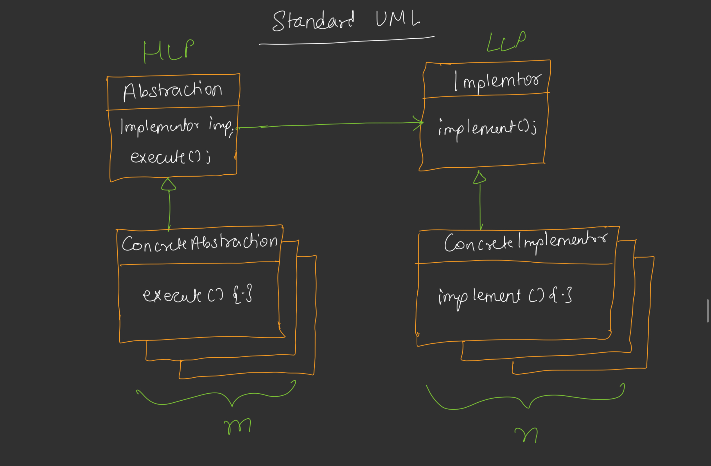
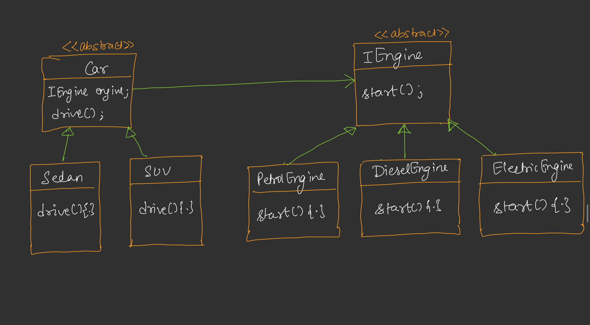

# Bridge Design Pattern

## Definition
The Bridge Design Pattern is a structural design pattern that decouples an abstraction from its implementation, allowing the two to vary independently. It separates the high-level abstraction (HLL) from the low-level implementation (LLL) by introducing a bridge between them, typically through composition.



## Purpose
- To separate abstraction and implementation so they can evolve independently.
- To avoid a combinatorial explosion of classes when combining multiple variations of abstractions and implementations.
- To improve flexibility and extensibility in systems with multiple dimensions of variability.

## Example Scenario


In a car system, we have different types of cars (e.g., Sedan, SUV) and different types of engines (e.g., Petrol, Diesel, Electric). The Bridge Pattern allows us to create a flexible architecture where any car can work with any engine without creating a class for each combination.
## Components
1. **Abstraction**: Defines the high-level interface and maintains a reference to the implementor (e.g., `Car` abstract class with an `Engine` reference).
2. **Refined Abstraction**: Extends the abstraction with specific behaviors (e.g., `Sedan`, `SUV`).
3. **Implementor Interface**: Defines the low-level interface for implementation classes (e.g., `Engine` interface with `start` method).
4. **Concrete Implementor**: Provides specific implementations of the implementor interface (e.g., `PetrolEngine`, `DieselEngine`, `ElectricEngine`).
5. **Client**: Creates instances of abstractions and implementations, linking them at runtime.

## Implementation [Code](/system-design/25/BridgePattern.java)
The provided Java code demonstrates the Bridge Pattern with a car system where the abstraction (`Car`) and implementation (`Engine`) hierarchies are separated. The `Car` abstraction (`Sedan`, `SUV`) uses composition to hold an `Engine` implementor (`PetrolEngine`, `DieselEngine`, `ElectricEngine`). This allows any car type to work with any engine type without creating a class for each combination.

### Key Features
- **Decoupling**: `Car` (abstraction) and `Engine` (implementation) can vary independently, avoiding a class explosion (e.g., no need for `PetrolSedan`, `ElectricSUV`, etc.).
- **Composition Over Inheritance**: The `Car` class uses an `Engine` object rather than inheriting engine-specific behavior.
- **Extensibility**: New car types (e.g., `Hatchback`) or engine types (e.g., `HybridEngine`) can be added without modifying existing code.
- **Runtime Flexibility**: The engine type is injected at runtime, allowing dynamic configuration.

## Usage
Run the `BridgePattern` class to simulate driving different cars with various engines. The program creates instances of `Sedan` and `SUV` with `PetrolEngine`, `DieselEngine`, and `ElectricEngine`, demonstrating how the abstraction and implementation can be combined flexibly.

### Example Output
```
Petrol engine starting with ignition!
Driving a Sedan on the highway.
Electric engine powering up silently!
Driving an SUV off-road.
Diesel engine roaring to life!
Driving an SUV off-road.
```

## Benefits
- **Independence**: Abstraction and implementation can evolve separately, reducing coupling.
- **Scalability**: Adding new car or engine types doesn’t require modifying existing classes.
- **Flexibility**: The bridge allows runtime configuration of implementations, supporting dynamic behavior.
- **Reduced Class Proliferation**: Avoids creating a subclass for every combination of abstraction and implementation.

## Limitations
- **Increased Complexity**: The pattern introduces additional interfaces and classes, which can complicate the design for simple systems.
- **Indirect Access**: The abstraction must go through the implementor interface, which may add a slight performance overhead.
- **Design Overhead**: Requires careful planning to identify the abstraction and implementation hierarchies upfront.

## Use Cases
- Systems with multiple dimensions of variability (as shown in the example: car types and engine types).
- GUI frameworks where widgets (abstraction) need to work with different rendering engines (implementation).
- Device drivers where the same high-level logic must work with different hardware implementations.

