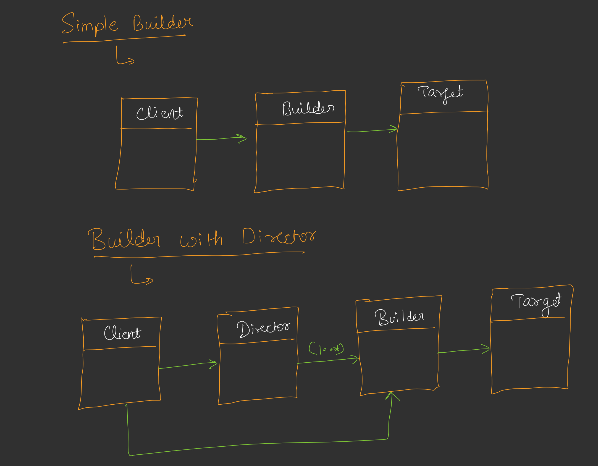
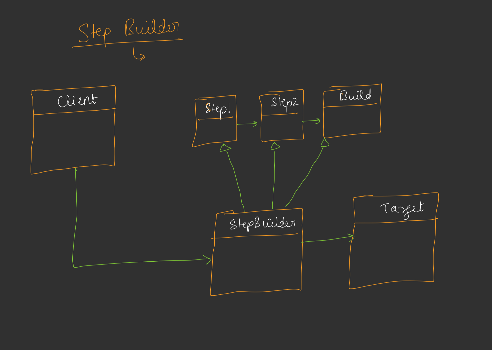
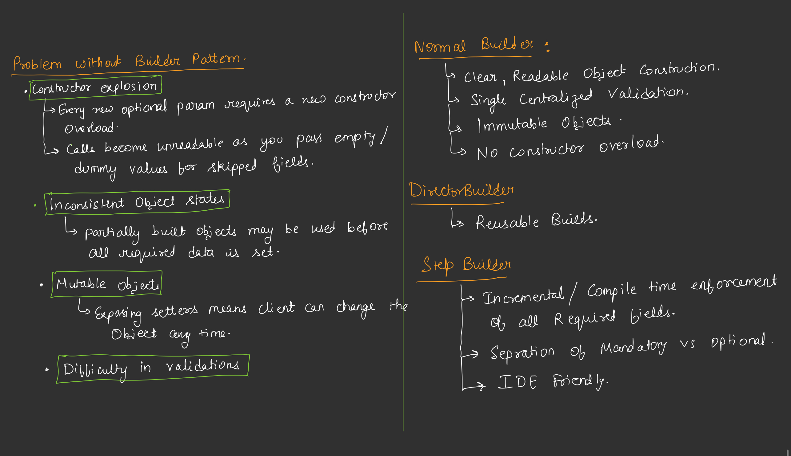

# Builder Design Pattern

The Builder Design Pattern is a creational design pattern that provides a flexible solution to construct complex objects step-by-step. It separates the construction of an object from its representation, allowing the same construction process to create different representations. This pattern is particularly useful when an object requires many parameters, some of which are optional, or when the construction process needs to be controlled in a specific order.

## Why Use the Builder Pattern?
- **Improves Readability**: Makes object creation more readable, especially when dealing with multiple parameters.
- **Immutability**: Enables the creation of immutable objects by avoiding setters.
- **Encapsulation**: Hides the complexity of object creation from the client.
- **Flexibility**: Allows step-by-step construction and supports different configurations of the same object.
- **Validation**: Provides a way to validate the object state before creation.

## When to Use the Builder Pattern?
- When an object has many optional parameters.
- When the construction process requires specific steps or validation.
- When you want to create immutable objects.
- When you need to create different configurations of a complex object.

## Structure of the Builder Pattern
- **Product**: The complex object being built (e.g., `HttpRequest`).
- **Builder**: An interface or class that defines the steps to construct the product.
- **Concrete Builder**: Implements the builder interface and constructs the product step-by-step.
- **Director** (optional): Coordinates the construction process, providing predefined construction recipes.
- **Client**: Uses the builder to construct the product.

## Variations of the Builder Pattern
Below are the different approaches to implementing the Builder Pattern, with links to example code for each.

### 1. Without Builder Pattern
[Code Link: Without Builder Pattern](/system-design/28/WithoutBuilder.java)

This approach uses telescoping constructors or setters to create objects. It has several drawbacks:
- **Telescoping Constructors**: Multiple constructors with increasing numbers of parameters lead to code duplication and reduced readability.
- **Mutable Objects**: Using setters makes the object mutable, which can lead to inconsistent states.
- **Error-Prone**: Clients may forget to set important fields, leading to invalid objects.

### 2. Simple Builder
[Code Link: Simple Builder](/system-design/28/SimpleBuilder/HttpRequest.java)

The Simple Builder provides a fluent interface for constructing objects. It includes:
- A nested builder class with methods for setting each field.
- Method chaining to improve readability.
- A `build()` method that validates and returns the final object.

**Advantages**:
- Eliminates telescoping constructors.
- Supports immutability by constructing the object only once.
- Easy to implement and understand.

**Drawbacks**:
- Does not enforce the order of construction steps.
- Clients can skip optional fields, which may lead to invalid states if not validated properly.

### 3. Step Builder
[Code Link: Step Builder](/system-design/28/StepBuilder/HttpRequest.java)

The Step Builder enforces a specific order of construction steps using interfaces. Each step returns the next step's interface, guiding the client through the process.

**Advantages**:
- Enforces a strict order of construction, reducing errors.
- Improves clarity by defining mandatory and optional steps.
- Supports immutability and validation.

**Drawbacks**:
- More complex to implement due to multiple interfaces.
- Less flexible for cases where step order is not critical.

### 4. Builder with Director
[Code Link: Builder with Director](/system-design/28/BuilderWithDirector/HttpRequest.java)

The Builder with Director introduces a `Director` class that provides predefined construction recipes. The director uses the builder to create specific configurations of the product.

**Advantages**:
- Simplifies client code by providing ready-to-use construction methods.
- Centralizes common construction logic.
- Reusable for creating multiple object configurations.

**Drawbacks**:
- Adds complexity with an additional class.
- May not be necessary for simple objects with few configurations.

## Example Use Case
Consider constructing an HTTP request object with required fields (URL, method, timeout) and optional fields (headers, query parameters, body). The Builder Pattern allows you to:
- Create requests with only required fields.
- Add optional fields in a readable, fluent manner.
- Ensure the object is immutable and valid before use.

## Conclusion
The Builder Design Pattern is a powerful tool for constructing complex objects in a readable, maintainable, and error-resistant way. Depending on your requirements, you can choose between a Simple Builder for flexibility, a Step Builder for strict construction order, or a Builder with Director for predefined configurations. Each approach addresses the limitations of traditional constructor-based or setter-based object creation.

