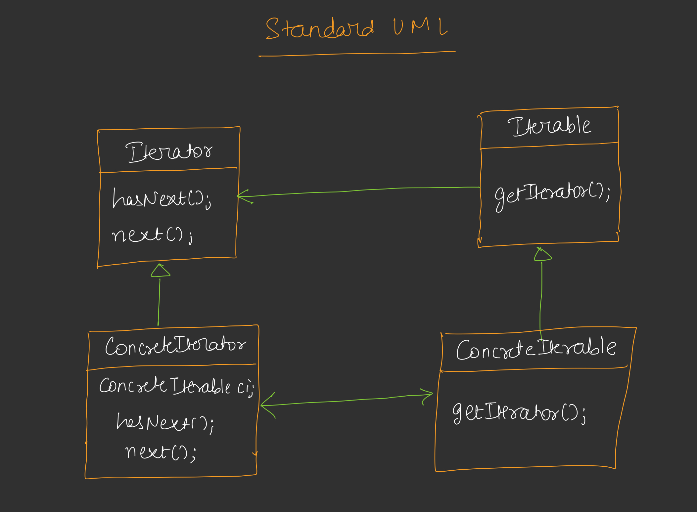
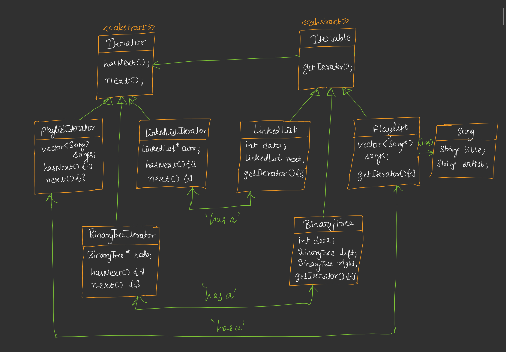

# Iterator Design Pattern

## Overview
The Iterator Design Pattern provides a way to access elements of a collection sequentially without exposing its underlying representation. It decouples the traversal of a collection from the collection itself, allowing clients to iterate over various data structures (e.g., linked lists, trees, arrays) in a uniform way.

## Purpose
The Iterator pattern is used to:
- Provide a standard way to traverse different data structures.
- Allow multiple traversals to occur simultaneously.
- Encapsulate the internal structure of a collection, promoting loose coupling.

## Components
1. **Iterator Interface**: Defines methods for traversal (`hasNext()` and `next()`).
2. **Concrete Iterator**: Implements the Iterator interface for a specific collection.
3. **Iterable Interface**: Declares a method to obtain an iterator (`getIterator()`).
4. **Concrete Collection**: Implements the Iterable interface and holds the data structure.
5. **Client**: Uses the iterator to traverse the collection.

## Implementation [Code](/system-design/29/IteratorPattern.java)

The provided Java code demonstrates the Iterator pattern with three different data structures:
- **LinkedList**: A singly linked list with a custom iterator to traverse nodes sequentially.
- **BinaryTree**: A binary tree with an inorder iterator to traverse nodes in left-root-right order.
- **Playlist**: A collection of songs stored in an ArrayList, with an iterator to access songs sequentially.

### Key Features
- **LinkedListIterator**: Traverses the linked list by following the `next` pointer.
- **BinaryTreeInorderIterator**: Uses a stack to perform an inorder traversal of the binary tree.
- **PlaylistIterator**: Iterates over an ArrayList of `Song` objects, accessing elements by index.

## Example Usage
The `main` method in `IteratorPattern.java` showcases the pattern:
1. Creates a linked list (1 → 2 → 3) and iterates over it, printing: `LinkedList contents: 1 2 3`.
2. Creates a binary tree (root = 2, left = 1, right = 3) and performs an inorder traversal, printing: `BinaryTree inorder: 1 2 3`.
3. Creates a playlist with two songs and iterates over it, printing song titles and artists.

## Benefits
- **Encapsulation**: Hides the internal structure of the collection.
- **Flexibility**: Supports multiple traversal methods (e.g., inorder for trees, sequential for lists).
- **Reusability**: The same iterator interface can be used for different collections.
- **Separation of Concerns**: Separates traversal logic from the collection's core functionality.

## Limitations
- May add complexity for simple collections where direct access is sufficient.
- Iterators may not support modifications to the collection during iteration (e.g., ConcurrentModificationException in Java's ArrayList).
- Custom iterators require additional code for each collection type.

## Use Cases
- Traversing complex data structures like trees, graphs, or lists.
- Providing a uniform interface for iterating over different collections.
- Supporting multiple simultaneous traversals of a collection.

## Conclusion
The Iterator pattern is a powerful tool for abstracting traversal logic, enabling flexible and reusable code for accessing collection elements. The provided Java implementation demonstrates its application across diverse data structures, showcasing its versatility and effectiveness.
