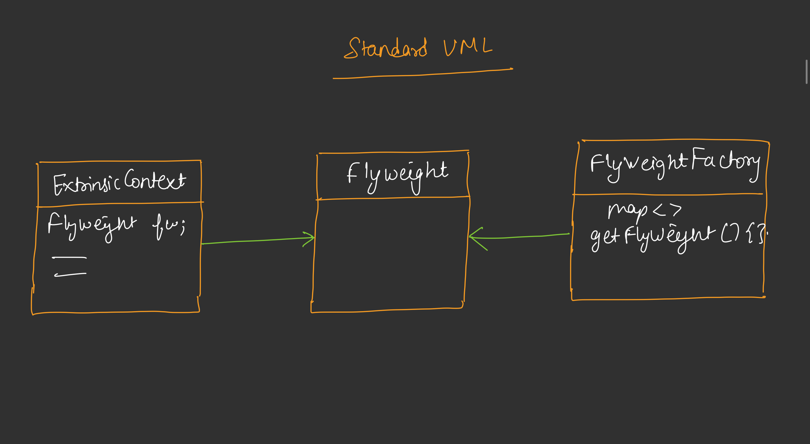

# Flyweight Design Pattern

## Overview
The Flyweight design pattern is used to minimize memory usage by sharing as much data as possible between similar objects. It separates intrinsic (shared) state from extrinsic (unique) state, allowing multiple objects to reuse the same instance of intrinsic data.

## Purpose
The Flyweight pattern is used to:
- Reduce memory footprint when dealing with large numbers of similar objects.
- Improve performance by avoiding redundant data duplication.
- Support efficient object management in resource-constrained environments.

## Components
1. **Flyweight Interface**: Defines the interface for shared objects.
2. **Concrete Flyweight**: Implements the flyweight interface, containing intrinsic state.
3. **Flyweight Factory**: Manages a pool of flyweight objects and provides access to them.
4. **Context**: Holds extrinsic state and interacts with the flyweight to perform operations.
5. **Client**: Uses the flyweight objects through the factory and context.

## Code Implementation 

The provided Java code demonstrates the Flyweight pattern with a space game scenario involving asteroids:
- **WithoutFlyweight** [Code](/system-design/30/WithoutFlyWeight.java) : Implements a basic asteroid system where each asteroid object holds both intrinsic and extrinsic properties, leading to high memory usage.
- **WithFlyweight** [Code](/system-design/30/WithFlyWeight.java) : Implements the Flyweight pattern with:
  - `AsteroidFlyweight`: Stores intrinsic properties (size, color, texture, material) shared among asteroids.
  - `AsteroidContext`: Holds extrinsic properties (position, velocity) unique to each asteroid.
  - `AsteroidFactory`: Manages a HashMap of flyweight objects, reusing them based on a unique key.
  - `SpaceGameWithFlyweight`: Utilizes the flyweight pattern to spawn and render asteroids efficiently.

### Key Features
- **Intrinsic State Sharing**: `AsteroidFlyweight` objects are reused for asteroids with identical properties.
- **Extrinsic State Management**: `AsteroidContext` stores unique position and velocity data.
- **Factory Optimization**: `AsteroidFactory` ensures only one flyweight instance per unique intrinsic state.

## Example Usage
The `main` method in `WithFlyWeight.java` and `WithoutFlyweight.java` showcases the pattern:
1. **WithoutFlyweight**: Spawns 1,000,000 asteroids with duplicated intrinsic properties, renders the first 5, and displays memory usage (~200 bytes per asteroid).
2. **WithFlyweight**: Spawns 1,000,000 asteroids with shared intrinsic properties and unique positions, renders the first 5, and shows reduced memory usage (~24 bytes per context plus shared flyweight memory).
3. Output compares memory efficiency between the two approaches.

## Benefits
- **Memory Efficiency**: Reduces memory usage by sharing intrinsic data.
- **Scalability**: Handles large numbers of objects effectively.
- **Centralized Management**: Flyweight factory simplifies object creation and reuse.

## Limitations
- Adds complexity due to the need for a factory and state separation.
- May not be beneficial for small numbers of objects.
- Requires careful design to ensure extrinsic state is truly unique and manageable.

## Use Cases
- Games with many similar objects (e.g., asteroids, trees, enemies).
- GUI systems with numerous widgets sharing common properties.
- Data-intensive applications requiring memory optimization.

## Conclusion
The Flyweight pattern is an effective solution for reducing memory usage in scenarios with numerous similar objects. The provided Java implementation demonstrates its application in a space game, comparing the traditional approach (`WithoutFlyweight`) with the optimized Flyweight approach (`WithFlyweight`), highlighting its ability to optimize resource usage while maintaining flexibility.
