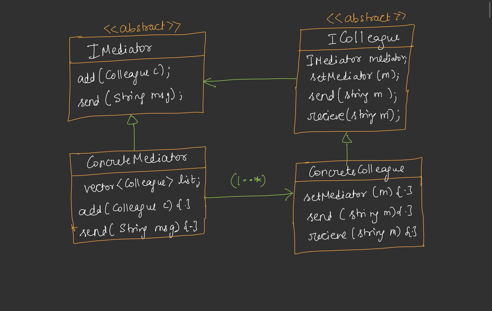

# Mediator Design Pattern

## Definition
The Mediator Design Pattern is a behavioral design pattern that defines an object (mediator) to encapsulate how a set of objects interact. It promotes loose coupling by centralizing communication logic, allowing objects to communicate indirectly through the mediator rather than directly with each other.



## Purpose
- To reduce direct dependencies between objects, improving maintainability and scalability.
- To centralize complex communication logic, avoiding a proliferation of direct connections (e.g., N*(N-1)/2 in the absence of a mediator).
- To simplify the addition of new features (e.g., muting, private messaging) by updating the mediator rather than individual objects.

## Components
1. **Mediator Interface**: Defines methods for registering colleagues and facilitating communication (e.g., `IMediator` with `registerColleague`, `send`, `sendPrivate`).
2. **Concrete Mediator**: Implements the mediator interface, managing colleague interactions and additional logic (e.g., `ChatMediator` handling broadcasts, private messages, and mutes).
3. **Colleague Interface**: Defines methods for sending and receiving messages, with a reference to the mediator (e.g., `Colleague` with `send`, `receive`, `sendPrivate`).
4. **Concrete Colleague**: Implements the colleague interface, delegating communication to the mediator (e.g., `User` class).
5. **Client**: Creates the mediator and colleagues, initiating interactions.

## Implementation
The provided Java code contrasts two approaches: a direct communication model (`WithoutMediator`) [CODE](/system-design/35/WithoutMediator.java) and a mediator-based model (`MediatorPattern`) [CODE](/system-design/35/MediatorPattern.java). In `WithoutMediator`, each `User` maintains a list of peers and handles communication (e.g., broadcasting, muting), leading to N^2 wiring complexity. In `MediatorPattern`, the `ChatMediator` centralizes communication, managing a list of `User` colleagues, handling broadcasts, private messages, and mute functionality.

### Key Features
- **Centralized Control**: The `ChatMediator` manages all interactions, reducing direct peer-to-peer connections.
- **Dynamic Registration**: Colleagues register with the mediator, allowing easy addition or removal.
- **Feature Centralization**: Features like muting and private messaging are handled in the mediator, avoiding duplication in each colleague.
- **Decoupling**: Users no longer need to know about other users directly, improving scalability.

## Usage
Run the `MediatorPattern` class to simulate a chat room. The program creates three users (`Rohan`, `Neha`, `Mohan`), sets up a mute (Rohan mutes Mohan), and demonstrates broadcasting and private messaging through the mediator.

### Example Output
```
[Rohan broadcasts]: Hello Everyone!
    Neha got from Rohan: Hello Everyone!
    Mohan got from Rohan: Hello Everyone!

[Rohan→Neha]: Hey Neha!
    Neha got from Rohan: Hey Neha!
```

**WithoutMediator Output (for comparison)**:
```
[Rohan broadcasts]: Hello everyone!
    Neha got from Rohan: Hello everyone!
    Mohan got from Rohan: Hello everyone!

[Rohan→Neha]: Hey Neha!
    Neha got from Rohan: Hey Neha!
```

## Benefits
- **Reduced Coupling**: Objects communicate via the mediator, avoiding tight dependencies.
- **Scalability**: Adding new users or features (e.g., logging) requires changes only to the mediator.
- **Simplified Colleagues**: Removes the need for each colleague to manage peer lists or duplicate logic.
- **Flexibility**: The mediator can enforce rules (e.g., muting) centrally.

## Limitations
- **Single Point of Failure**: The mediator becomes a bottleneck; if it fails, communication breaks down.
- **Complexity**: The mediator can become complex as it handles all interaction logic.
- **Overhead**: Adds an extra layer, potentially increasing runtime overhead for simple systems.

## Use Cases
- Chat applications (as shown in the example).
- GUI frameworks where multiple components interact through a controller.
- Air traffic control systems where planes communicate via a central tower.

