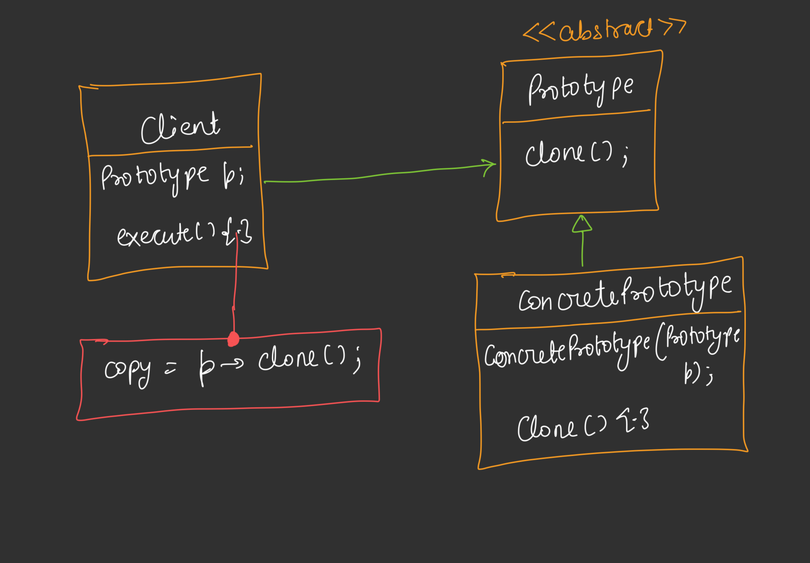

# Prototype Design Pattern

## Definition
The Prototype Design Pattern is a creational design pattern that allows creating new objects by copying an existing object, known as a prototype. It avoids the costly process of creating objects from scratch by cloning a pre-initialized instance and then customizing it as needed.



## Purpose
- To improve performance by avoiding expensive initialization processes (e.g., database calls or complex calculations).
- To enable the creation of new objects without specifying their exact class, using cloning instead.
- To support flexibility in object creation, especially when the type of objects to create is determined by a prototypical instance.

## Components
1. **Prototype Interface**: Defines a method for cloning (e.g., `Cloneable` with `clone()`).
2. **Concrete Prototype**: Implements the prototype interface and provides the cloning mechanism (e.g., `NPC` with a copy constructor and `clone` method).
3. **Client**: Uses the prototype to create new objects by cloning and modifying them as needed.

## Implementation
The provided Java code contrasts two approaches: a direct creation model (`WithoutPrototype`) [CODE](/system-design/36/WithoutPrototype.java) and a prototype-based model (`PrototypePattern`) [CODE](/system-design/36/PrototypePattern.java) . In `WithoutPrototype`, each `NPC` object requires a heavy constructor with all fields, leading to repetitive and error-prone initialization. In `PrototypePattern`, the `NPC` class implements the `Cloneable` interface, allowing a single "heavy" instance to be cloned and tweaked, reducing initialization overhead.

### Key Features
- **Lazy Initialization Avoidance**: The prototype creates a template once, then clones it, avoiding repeated heavy setups.
- **Customizable Copies**: Cloned objects can be modified using setters (e.g., `setName`, `setHealth`) without affecting the original.
- **Efficiency**: Cloning is faster than recreating objects from scratch, especially for complex objects.
- **Flexibility**: New variants can be created by tweaking cloned instances rather than redefining classes.

## Usage
Run the `PrototypePattern` class to simulate creating NPC (non-player character) objects in a game. The program creates a base `NPC` (e.g., "Alien") and generates clones with modifications (e.g., "Powerful Alien" with increased health), demonstrating the pattern's efficiency.

### Example Output
```
Setting up template NPC 'Alien'
Cloning NPC 'Alien'
NPC Alien [HP=30 ATK=5 DEF=2]
Cloning NPC 'Alien'
NPC Powerful Alien [HP=50 ATK=5 DEF=2]
```

**WithoutPrototype Output (for comparison)**:
```
Creating NPC 'Alien' [HP:30, ATK:5, DEF:2]
  NPC: Alien | HP=30 ATK=5 DEF=2
Creating NPC 'Powerful Alien' [HP:30, ATK:5, DEF:5]
  NPC: Powerful Alien | HP=30 ATK=5 DEF=5
```

## Benefits
- **Performance**: Reduces the cost of object creation by reusing a prototype.
- **Simplicity**: Avoids the need to instantiate classes with complex constructors repeatedly.
- **Extensibility**: Adding new object variants is easy by cloning and modifying existing prototypes.
- **Consistency**: Ensures all objects are initialized with a consistent base state.

## Limitations
- **Cloning Complexity**: Implementing a proper deep copy can be challenging, especially for objects with nested references.
- **Memory Usage**: Maintaining multiple clones may increase memory usage if not managed properly.
- **Initialization Overhead**: The initial prototype setup can still be resource-intensive.

## Use Cases
- Game development for creating multiple instances of characters or objects (as shown in the example).
- UI frameworks where multiple instances of widgets need to be created with slight variations.
- Document processing where templates are cloned to generate new documents with modifications.

