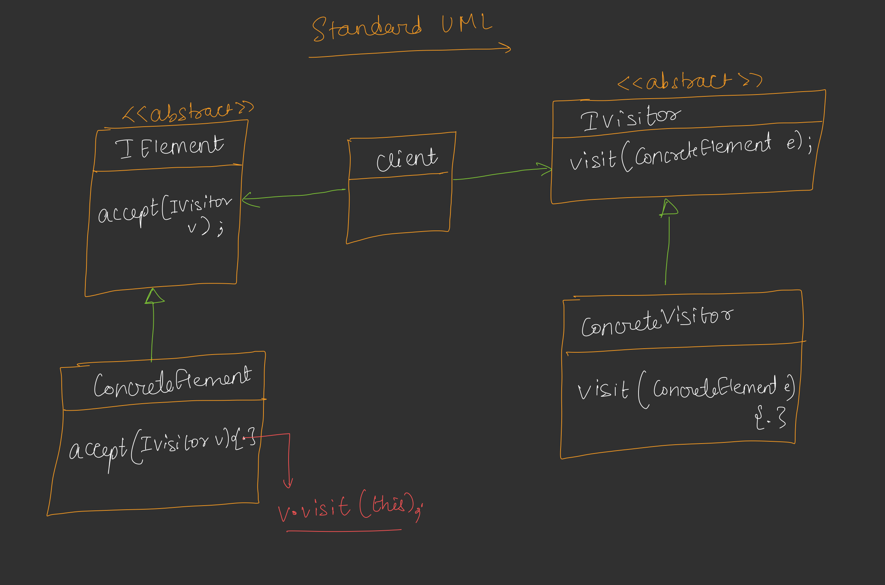
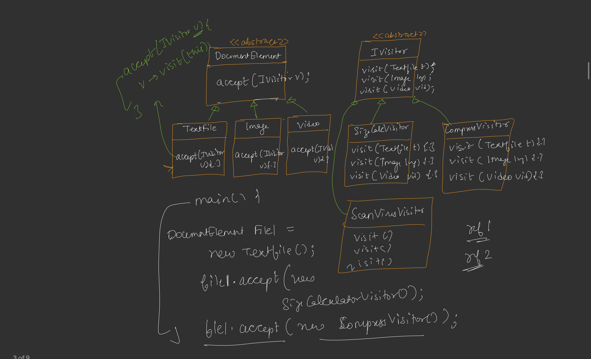

# Visitor Design Pattern

## Definition
The Visitor Design Pattern is a behavioral design pattern that allows you to add new operations to a set of objects without modifying their classes. It separates the algorithm from the object structure by defining a visitor interface that implements the operations for each object type, enabling double dispatch.




## Purpose
- To add new functionality to a class hierarchy without altering existing code, adhering to the Open/Closed Principle.
- To perform operations on elements of an object structure (e.g., a file system) where the operation varies based on the element type.
- To centralize related operations that would otherwise be scattered across multiple classes.

## Components
1. **Visitor Interface**: Declares a `visit` method for each concrete element type (e.g., `FileSystemVisitor` with `visit` for `TextFile`, `ImageFile`, `VideoFile`).
2. **Concrete Visitor**: Implements the visitor interface with specific operations for each element type (e.g., `SizeCalculationVisitor`, `CompressionVisitor`, `VirusScanningVisitor`).
3. **Element Interface/Abstract Class**: Defines an `accept` method that takes a visitor as an argument (e.g., `FileSystemItem` with `accept`).
4. **Concrete Element**: Implements the element interface and calls `visitor.visit(this)` in the `accept` method (e.g., `TextFile`, `ImageFile`, `VideoFile`).
5. **Client**: Creates elements and applies visitors to perform operations.

## Implementation [CODE](/system-design/38/VisitorPattern.java)

The provided Java code demonstrates the Visitor Pattern with a file system example. The `FileSystemItem` abstract class serves as the element hierarchy, with concrete classes `TextFile`, `ImageFile`, and `VideoFile`. The `FileSystemVisitor` interface defines operations, implemented by `SizeCalculationVisitor`, `CompressionVisitor`, and `VirusScanningVisitor` to perform size calculation, compression, and virus scanning, respectively. The `VisitorPattern` class applies these visitors to file instances.

### Key Features
- **Double Dispatch**: The `accept` method enables the visitor to determine the operation based on both the visitor and element types.
- **Extensibility**: New operations (e.g., encryption) can be added by creating a new visitor without modifying existing classes.
- **Separation of Concerns**: Algorithms (visitors) are decoupled from the element structure (file types).
- **Type-Specific Behavior**: Each visitor handles `TextFile`, `ImageFile`, and `VideoFile` differently, reflecting their unique requirements.

## Usage
Run the `VisitorPattern` class to simulate operations on file system items. The program creates an `ImageFile` and a `VideoFile`, then applies `SizeCalculationVisitor`, `CompressionVisitor`, and `VirusScanningVisitor` to demonstrate the pattern’s flexibility.

### Example Output
```
Calculating size for IMAGE file: sample.jpg
Compressing IMAGE file: sample.jpg
Scanning IMAGE file: sample.jpg
Compressing VIDEO file: test.mp4
```

## Benefits
- **Open/Closed Principle**: New operations can be added without changing existing element classes.
- **Centralized Operations**: Related algorithms are grouped in visitor classes, improving maintainability.
- **Flexibility**: Supports adding new element types or operations without extensive refactoring.
- **Type Safety**: The visitor interface enforces handling all element types.

## Limitations
- **Complexity**: Adding new element types requires updating all existing visitors, violating the Open/Closed Principle for elements.
- **Tight Coupling**: Elements and visitors must know about each other’s interfaces, limiting independence.
- **Performance Overhead**: Double dispatch introduces additional method calls, which may impact performance in large systems.

## Use Cases
- File system operations (as shown in the example: size calculation, compression, virus scanning).
- Compilers or interpreters for traversing abstract syntax trees with multiple analysis types.
- GUI frameworks for applying different rendering or layout algorithms to components.

