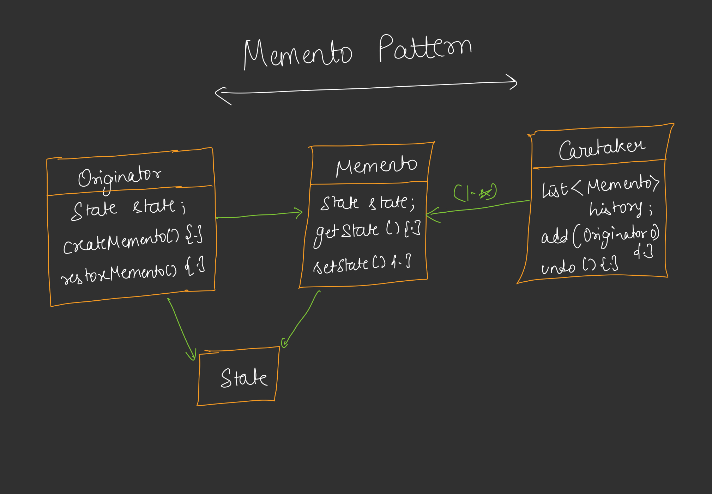

# Memento Design Pattern

## Definition
The Memento Design Pattern is a behavioral design pattern that provides a way to capture and restore an object's internal state without exposing its implementation details. It allows for undo/rollback functionality by saving snapshots of an object's state and restoring it when needed.



## Purpose
- To enable state preservation and restoration without violating encapsulation.
- To support undo/redo operations or transaction management by saving and reverting to previous states.
- To decouple the originator (object whose state is saved) from the caretaker (entity managing the state history).

## Components
1. **Memento**: A class that stores the originator's state (e.g., `DatabaseMemento` with a snapshot of `Map<String, String>` data).
2. **Originator**: The object whose state is to be saved or restored (e.g., `Database` with methods to create and restore mementos).
3. **Caretaker**: Manages the mementos, initiating save and restore operations (e.g., `TransactionManager` handling transactions).
4. **Client**: Uses the originator and caretaker to perform state-related operations.

## Implementation [CODE](/system-design/39/MementoPattern.java)
The provided Java code demonstrates the Memento Pattern with a database system. The `Database` class (Originator) maintains a `Map` of records and provides methods to create a `DatabaseMemento` (snapshot) and restore from it. The `TransactionManager` (Caretaker) manages the memento, supporting transaction begin, commit, and rollback operations. The `MementoPattern` class simulates a database transaction with a successful commit and a failed rollback scenario.

### Key Features
- **Encapsulation**: The `DatabaseMemento` class hides the internal state (`records`) from the caretaker, ensuring data privacy.
- **State Persistence**: The memento captures the database's state at a given point, enabling rollback.
- **Transaction Control**: The caretaker manages the transaction lifecycle (begin, commit, rollback) using the memento.
- **Flexibility**: New state-saving logic can be added without altering the originator's core functionality.

## Usage
Run the `MementoPattern` class to simulate database operations. The program demonstrates inserting records, committing a transaction, and rolling back a failed transaction, showcasing state restoration.

### Example Output
```
=== BEGIN TRANSACTION ===
Inserted: user1 = Aditya
Inserted: user2 = Rohit
=== COMMIT TRANSACTION ===
Transaction committed successfully!

--- Current Database State ---
user1 = Aditya
user2 = Rohit
-----------------------------

=== BEGIN TRANSACTION ===
Inserted: user3 = Saurav
Inserted: user4 = Manish

--- Current Database State ---
user1 = Aditya
user2 = Rohit
user3 = Saurav
user4 = Manish
-----------------------------

ERROR: Something went wrong during transaction!
=== ROLLBACK TRANSACTION ===
Database restored from backup!
Transaction rolled back!

--- Current Database State ---
user1 = Aditya
user2 = Rohit
-----------------------------
```

## Benefits
- **Undo Capability**: Allows reverting to a previous state, useful for error recovery.
- **Encapsulation**: Protects the originator's internal state from external access.
- **Simplicity**: Provides a clean interface for state management without complex history tracking.
- **Reusability**: The memento pattern can be applied to various objects requiring state preservation.

## Limitations
- **Memory Usage**: Storing multiple mementos can consume significant memory, especially for large objects.
- **Complexity**: Managing a stack of mementos for multiple undo levels adds overhead.
- **Shallow Copy Risk**: If not implemented carefully, mementos may only perform shallow copies, missing nested object changes.

## Use Cases
- Database transaction management (as shown in the example).
- Undo/redo functionality in text editors or graphic design tools.
- Game state saving and loading for checkpoint systems.

