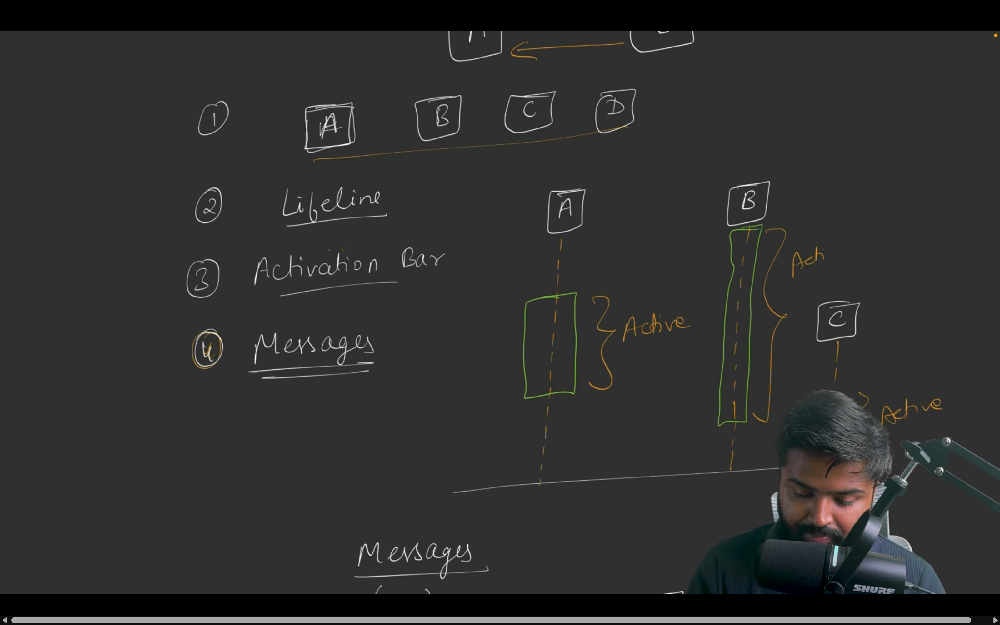

# Class and Sequence Diagram in UML Diagrams

A **UML diagram** (Unified Modeling Language diagram) is a visual representation used to describe the structure and behavior of a system. UML diagrams help in designing and understanding software systems by showing how different parts interact.

There are two main types:

1. **Structural Diagrams** – Show the static structure of a system (e.g., classes, objects, relationships).
   - **Class Diagram**

2. **Behavioral Diagrams** – Show the dynamic behavior (e.g., interactions, activities).
   - **Sequence Diagram**

UML diagrams are widely used in software engineering for planning, documenting, and communicating system designs.

`NOTE`: There are 7 diagrams in both structural and behavioral categories, but we will focus on the most commonly used ones.

## CLASS Diagram

A **Class Diagram**  represents the static structure of a system by showing classes, attributes, methods, and relationships.
### Components of a Class Diagram
- **Class**: Represents a blueprint for creating objects. It contains attributes (properties) and methods (functions).
- **Attributes**: Characteristics or properties of a class. They define the data that the class holds.
- **Methods**: Functions or operations that a class can perform. They define the behavior of the class.
- **Relationships**: Connections between classes that show how they interact with each other. Common relationships include:
  - **Association**: A general connection between two classes.
  - **Aggregation**: A "whole-part" relationship where one class is a part of another class.
  - **Composition**: A stronger form of aggregation where the part cannot exist independently of the whole.
  - **Inheritance**: A relationship where one class (child) inherits properties and methods from another class (parent).

### Example of a Class Diagram

### Code Example

### 1. **Simple Association ("has a" relationship)**
A simple association represents a "has a" relationship where one class uses another, but they are independent. For example, a `Person` can have a `Car`, but the `Car` can exist without the `Person`.

[Code Example](/system-design/4/SimpleAssociation.cpp)

Here, `Person` and `Car` are loosely coupled. The `Car` can exist independently of the `Person`, and the `Person` can exist without a `Car`.

---

### 2. **Aggregation (a special "has a" relationship)**
Aggregation is a "whole-part" relationship where the part can exist independently of the whole. For example, a `Department` has `Employee`s, but if the `Department` is dissolved, the `Employee`s can still exist.

[Code Example](/system-design/4/Aggragation.cpp)

In this example, `Employee`s are part of a `Department`, but they can exist independently. The `Department` doesn’t own the `Employee`s; it just references them.

---

### 3. **Composition (a stronger "has a" relationship)**
Composition is a "whole-part" relationship where the part cannot exist without the whole. For example, a `House` has `Room`s, and if the `House` is destroyed, the `Room`s are also destroyed.

[Code Example](/system-design/4/Composition.cpp)

In this case, `Room`s are tightly coupled to the `House`. When the `House` object is destroyed, the `Room`s are also destroyed because they are owned by the `House`.

---

### Summary of Differences
- **Simple Association**: Loose coupling; objects are independent (`Person` and `Car`).
- **Aggregation**: Whole-part relationship; parts can exist independently (`Department` and `Employee`).
- **Composition**: Stronger whole-part relationship; parts cannot exist without the whole (`House` and `Room`).

## SEQUENCE Diagram

A **Sequence Diagram** illustrates the flow of messages between objects over time to perform a specific function.
### Components of a Sequence Diagram
- **Objects**: Represented by rectangles at the top of the diagram. They are the participants in the interaction.
- **Lifelines**: Vertical dashed lines that extend down from each object, representing the object's existence over time.
- **Activation Boxes**: Rectangles on the lifelines that indicate when an object is active or controlling the flow of messages.
- **Messages**: Horizontal arrows between lifelines that represent communication between objects. They can be synchronous (solid arrow) or asynchronous (open arrow). 
- **Return Messages**: Dashed arrows that indicate the return of control or data from one object to another, mainly used for synchronous message.

### Example of a Sequence Diagram

### Real-World Example
