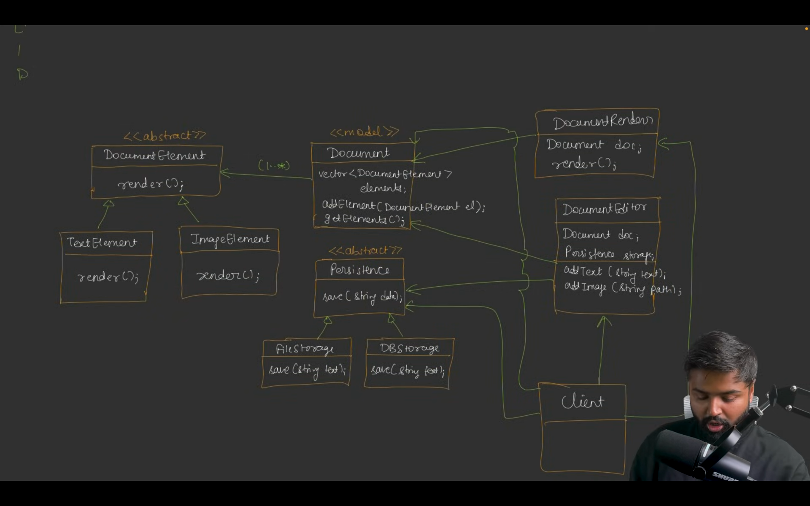

# Document Editor LLD - Project 1

## Overview
This project demonstrates two implementations of a Document Editor in Java: a poorly designed version and an improved version that adheres to SOLID principles. The Document Editor allows users to add text and images to a document, render the content, and save it to a file. Below, we compare the two designs and explain how the improved version leverages SOLID principles to address the shortcomings of the initial design.

## Bad Design (Initial Version) [Code](/system-design/7/BadDesign/DocumentEditorClient.java)
The initial `DocumentEditor` class combines multiple responsibilities, including element management, rendering, and file storage. It uses a single `List<String>` to store both text and image elements, relying on runtime checks (e.g., checking file extensions like `.jpg` or `.png`) to differentiate between them. This approach has several issues:

- **Tight Coupling**: The class handles element storage, rendering logic, and file I/O directly, making it difficult to modify or extend any single aspect without affecting others.
- **Limited Extensibility**: Adding new element types (e.g., tables, hyperlinks) requires modifying the `renderDocument` method to include new runtime checks, violating the Open/Closed Principle.
- **No Abstraction**: Elements are stored as raw strings, with no clear distinction between types, leading to fragile logic for rendering (e.g., checking string suffixes).
- **Single Responsibility Violation**: The `DocumentEditor` class is responsible for both document composition and persistence, making it harder to change storage mechanisms (e.g., to a database).
- **Poor Maintainability**: The lack of modularity makes the code harder to test and maintain, as changes to one part (e.g., rendering) can break others (e.g., saving).

## Good Design (Improved Version) [Code](/system-design/7/GoodDesign/DocumentEditorClient.java)
The improved version refactors the code to follow SOLID principles, resulting in a more modular, extensible, and maintainable design. Key components include interfaces (`DocumentElement`, `Persistence`), concrete element classes (`TextElement`, `ImageElement`, `NewLineElement`, `TabSpaceElement`), a `Document` class for managing elements, and a `FileStorage` class for persistence.

### Key Improvements and SOLID Principles
1. **Single Responsibility Principle (SRP)**:
   - The `Document` class is responsible for managing and rendering document elements, while the `Persistence` interface and its implementations (e.g., `FileStorage`) handle saving the document.
   - The `DocumentEditor` class acts as a coordinator, delegating rendering to `Document` and saving to `Persistence`, rather than handling everything itself.
   - Each class has a single, well-defined responsibility, making the system easier to modify and test.

2. **Open/Closed Principle (OCP)**:
   - The `DocumentElement` interface allows new element types (e.g., `NewLineElement`, `TabSpaceElement`) to be added without modifying existing classes. New elements implement the `render()` method, and the `Document` class renders them polymorphically.
   - This eliminates the need for runtime checks (e.g., checking file extensions), as each element knows how to render itself.

3. **Liskov Substitution Principle (LSP)**:
   - All `DocumentElement` implementations (`TextElement`, `ImageElement`, etc.) can be used interchangeably in the `Document` class without affecting its behavior. Each implementation adheres to the `render()` contract, ensuring consistent behavior.

4. **Interface Segregation Principle (ISP)**:
   - The `DocumentElement` and `Persistence` interfaces are focused and minimal, providing only the methods needed for their respective roles (`render()` for elements, `save()` for persistence).
   - Clients like `DocumentEditor` interact with these interfaces, avoiding dependencies on unnecessary methods.

5. **Dependency Inversion Principle (DIP)**:
   - The `DocumentEditor` class depends on abstractions (`Document` and `Persistence`) rather than concrete implementations. This allows swapping storage mechanisms (e.g., `FileStorage` for `DBStorage`) without modifying the `DocumentEditor` class.
   - Dependency injection is used to provide the `Document` and `Persistence` instances to `DocumentEditor` via its constructor.

### Additional Benefits
- **Extensibility**: New element types (e.g., hyperlinks, tables) can be added by creating new classes that implement `DocumentElement`, without changing existing code.
- **Flexibility**: The `Persistence` interface allows easy integration of new storage mechanisms, such as databases, by implementing the `save()` method.
- **Maintainability**: Separating concerns into smaller, focused classes makes the code easier to understand, test, and modify.
- **Robustness**: The use of polymorphism eliminates fragile runtime checks, reducing the risk of errors when handling different element types.

## Usage Example
The improved version supports more flexible document composition, as shown in the `DocumentEditorClient` class:
- Elements like text, images, new lines, and tab spaces are added using specific methods (`addText`, `addImage`, `addNewLine`, `addTabSpace`).
- The `Document` class renders all elements by calling their `render()` methods, producing a cohesive output.
- The `saveDocument` method delegates to the `Persistence` implementation, allowing the document to be saved to a file or other storage.

## Conclusion
The improved design adheres to SOLID principles, resulting in a modular, extensible, and maintainable Document Editor. By separating concerns, using interfaces, and leveraging polymorphism, it addresses the limitations of the initial design, making it better suited for real-world use cases where flexibility and scalability are essential.

### More Improved Design
