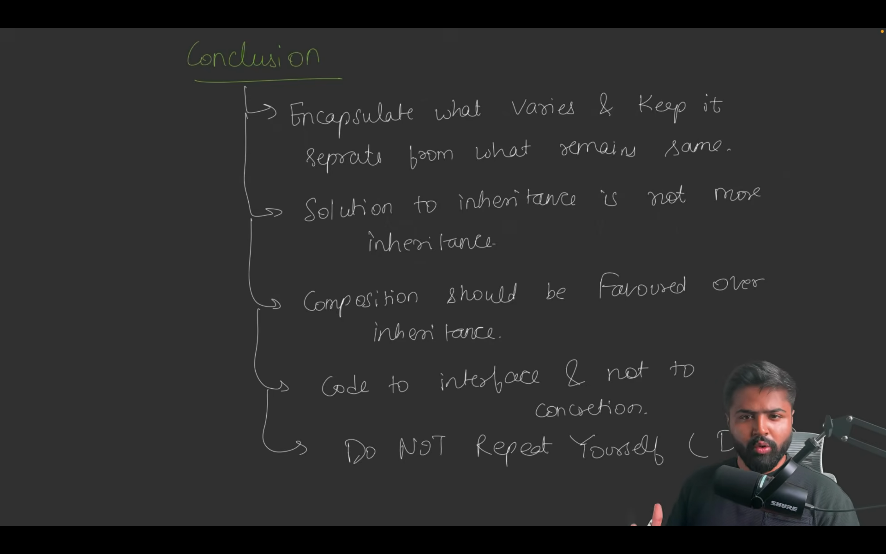

# Design Pattern in Low-Level Design (LLD)

A **design pattern** is a reusable solution to a common problem in software design. It serves as a template, not finished code, guiding developers to create flexible, maintainable, and scalable systems. Patterns like Singleton, Factory, Observer, and Strategy address recurring challenges, improving code organization and adaptability.

## Strategy Design Pattern
The **Strategy Design Pattern** is a behavioral design pattern that enables defining a family of algorithms, encapsulating each in a separate class, and making them interchangeable at runtime. This pattern decouples the algorithm implementation from the client, allowing dynamic behavior changes without altering the core logic.

### Key Components
1. **Context**: The class that holds a reference to a strategy and delegates tasks to it.
2. **Strategy**: An interface or abstract class defining the contract for algorithms.
3. **Concrete Strategy**: Classes implementing the strategy interface, providing specific algorithm implementations.

### Example: Robot Behavior System
Below is an implementation of the Strategy Design Pattern applied to a robot system, where robots can have different behaviors for walking, talking, and flying. The behaviors are interchangeable, allowing flexible configuration of robot capabilities.

```java
// --- Strategy Interface for Walk ---
interface WalkableRobot {
    void walk();
}

// --- Concrete Strategies for Walk ---
class NormalWalk implements WalkableRobot {
    public void walk() {
        System.out.println("Walking normally...");
    }
}

class NoWalk implements WalkableRobot {
    public void walk() {
        System.out.println("Cannot walk.");
    }
}

// --- Strategy Interface for Talk ---
interface TalkableRobot {
    void talk();
}

// --- Concrete Strategies for Talk ---
class NormalTalk implements TalkableRobot {
    public void talk() {
        System.out.println("Talking normally...");
    }
}

class NoTalk implements TalkableRobot {
    public void talk() {
        System.out.println("Cannot talk.");
    }
}

// --- Strategy Interface for Fly ---
interface FlyableRobot {
    void fly();
}

// --- Concrete Strategies for Fly ---
class NormalFly implements FlyableRobot {
    public void fly() {
        System.out.println("Flying normally...");
    }
}

class NoFly implements FlyableRobot {
    public void fly() {
        System.out.println("Cannot fly.");
    }
}

// --- Robot Base Class (Context) ---
abstract class Robot {
    protected WalkableRobot walkBehavior;
    protected TalkableRobot talkBehavior;
    protected FlyableRobot flyBehavior;

    public Robot(WalkableRobot w, TalkableRobot t, FlyableRobot f) {
        this.walkBehavior = w;
        this.talkBehavior = t;
        this.flyBehavior = f;
    }

    public void walk() {
        walkBehavior.walk();
    }

    public void talk() {
        talkBehavior.talk();
    }

    public void fly() {
        flyBehavior.fly();
    }

    public abstract void projection(); // Abstract method for subclasses
}

// --- Concrete Robot Types ---
class CompanionRobot extends Robot {
    public CompanionRobot(WalkableRobot w, TalkableRobot t, FlyableRobot f) {
        super(w, t, f);
    }

    public void projection() {
        System.out.println("Displaying friendly companion features...");
    }
}

class WorkerRobot extends Robot {
    public WorkerRobot(WalkableRobot w, TalkableRobot t, FlyableRobot f) {
        super(w, t, f);
    }

    public void projection() {
        System.out.println("Displaying worker efficiency stats...");
    }
}

// --- Main Function ---
public class StrategyDesignPattern {
    public static void main(String[] args) {
        // Companion Robot: Can walk and talk, but cannot fly
        Robot robot1 = new CompanionRobot(new NormalWalk(), new NormalTalk(), new NoFly());
        robot1.walk();
        robot1.talk();
        robot1.fly();
        robot1.projection();

        System.out.println("--------------------");

        // Worker Robot: Can fly, but cannot walk or talk
        Robot robot2 = new WorkerRobot(new NoWalk(), new NoTalk(), new NormalFly());
        robot2.walk();
        robot2.talk();
        robot2.fly();
        robot2.projection();
    }
}
```

**Output**:
```
Walking normally...
Talking normally...
Cannot fly.
Displaying friendly companion features...
--------------------
Cannot walk.
Cannot talk.
Flying normally...
Displaying worker efficiency stats...
```

### Explanation of the Example
- **Context**: The `Robot` class acts as the context, holding references to `WalkableRobot`, `TalkableRobot`, and `FlyableRobot` strategies.
- **Strategy Interfaces**: `WalkableRobot`, `TalkableRobot`, and `FlyableRobot` define contracts for walking, talking, and flying behaviors.
- **Concrete Strategies**: Classes like `NormalWalk`, `NoWalk`, `NormalTalk`, `NoTalk`, `NormalFly`, and `NoFly` implement specific behaviors.
- **Dynamic Behavior**: The `CompanionRobot` and `WorkerRobot` are configured with different combinations of behaviors at runtime, demonstrating the pattern’s flexibility.

### Advantages
1. **Flexibility**: Behaviors can be swapped dynamically without modifying the `Robot` class.
2. **Open/Closed Principle**: New behaviors (e.g., `FastWalk`, `LoudTalk`) can be added without changing existing code.
3. **Separation of Concerns**: Each behavior is encapsulated in its own class, improving maintainability.
4. **Reusability**: Strategies can be reused across different robot types.

### Disadvantages
1. **Increased Complexity**: Multiple strategy classes and interfaces can make the codebase harder to navigate.
2. **Overhead**: For simple systems with few behaviors, the pattern may introduce unnecessary complexity.
3. **Client Responsibility**: The client must configure the correct strategy, which can lead to errors if not handled properly.

### When to Use
- When a class needs to support multiple algorithms or behaviors that can be swapped at runtime.
- When you want to avoid conditional statements (e.g., `if-else`) for selecting behaviors.
- When algorithms or behaviors need to be encapsulated for reuse and maintainability.

### When Not to Use
- When there’s only one behavior or algorithm, as the pattern adds unnecessary overhead.
- When the cost of maintaining multiple strategy classes outweighs the benefits of flexibility.

### Real-World Example
In a robotics application, different robots may have varying capabilities (e.g., walking, flying, or talking). The Strategy Pattern allows you to define these behaviors independently and assign them to robots dynamically. For instance:
- A **Companion Robot** might walk and talk to interact with humans but not fly.
- A **Worker Robot** might fly to navigate work environments but lack walking or talking capabilities.

This pattern is also common in:
- **Payment Systems**: Switching between payment methods (e.g., Credit Card, PayPal).
- **Game AI**: Changing enemy behaviors (e.g., aggressive, defensive).
- **Navigation Apps**: Selecting routing algorithms (e.g., shortest path, fastest route).

### Comparison with Simple Payment Example
The robot example extends the simpler payment example (shown below) by incorporating multiple strategy types (walk, talk, fly) instead of a single strategy (payment). This demonstrates how the pattern scales to handle complex systems with multiple interchangeable behaviors.

```java
// Simple Payment Example
public interface PaymentStrategy {
    void pay(int amount);
}

public class CreditCardPayment implements PaymentStrategy {
    @Override
    public void pay(int amount) {
        System.out.println("Paid " + amount + " using Credit Card.");
    }
}

public class PayPalPayment implements PaymentStrategy {
    @Override
    public void pay(int amount) {
        System.out.println("Paid " + amount + " using PayPal.");
    }
}

public class ShoppingCart {
    private PaymentStrategy paymentStrategy;

    public void setPaymentStrategy(PaymentStrategy paymentStrategy) {
        this.paymentStrategy = paymentStrategy;
    }

    public void checkout(int amount) {
        if (paymentStrategy == null) {
            throw new IllegalStateException("Payment strategy not set.");
        }
        paymentStrategy.pay(amount);
    }
}

public class Main {
    public static void main(String[] args) {
        ShoppingCart cart = new ShoppingCart();
        cart.setPaymentStrategy(new CreditCardPayment());
        cart.checkout(100);
        cart.setPaymentStrategy(new PayPalPayment());
        cart.checkout(200);
    }
}
```

**Output**:
```
Paid 100 using Credit Card.
Paid 200 using PayPal.
```

### Summary
The Strategy Design Pattern promotes flexibility and maintainability by encapsulating algorithms or behaviors in separate classes. The robot example illustrates how multiple strategies can be combined to create complex, interchangeable behaviors, while the payment example shows a simpler application. Use this pattern when you need runtime flexibility and want to adhere to the Open/Closed Principle, but avoid it for simple systems where the overhead outweighs the benefits.

