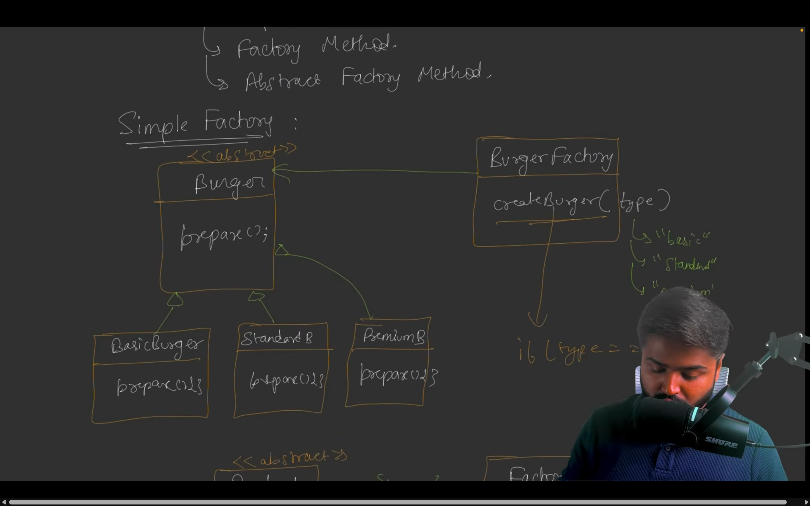
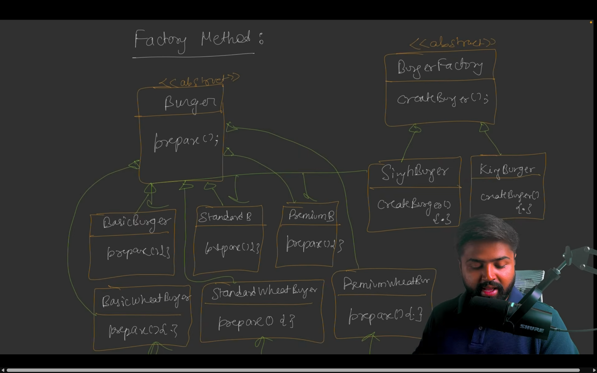
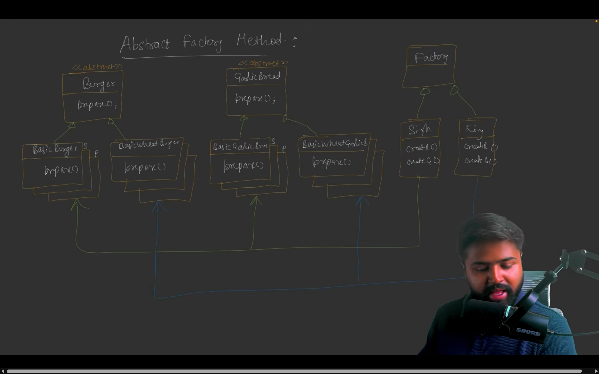

# Factory Design Pattern in Low-Level Design (LLD)

The **Factory Design Pattern** is a creational design pattern that provides a way to create objects without specifying the exact class of object that will be created. It encapsulates object creation logic in a separate class or method, promoting loose coupling and making the system more flexible and maintainable. The pattern is particularly useful when you need to create different types of objects based on some input or condition.

There are three main variants of the Factory Pattern:
1. **Simple Factory**: A single class with a method to create objects based on a parameter (not a true design pattern but a common idiom).
2. **Factory Method**: Defines an interface or abstract class for creating objects, allowing subclasses to decide which class to instantiate.
3. **Abstract Factory**: Provides an interface for creating families of related or dependent objects without specifying their concrete classes.

Below, I’ll explain each variant using the provided code, with a focus on how they are implemented and their differences.

## Simple Factory
The **Simple Factory** is a basic approach where a single factory class is responsible for creating objects based on input parameters. It centralizes object creation but doesn’t use inheritance for extensibility.

### Example: Simple Factory
The provided `SimpleFactory` code demonstrates a simple factory that creates different types of burgers based on a string input.



```java
// --- Burger Interface ---
interface Burger {
    void prepare();
}

// --- Concrete Burger Implementations ---
class BasicBurger implements Burger {
    @Override
    public void prepare() {
        System.out.println("Preparing Basic Burger with bun, patty, and ketchup!");
    }
}

class StandardBurger implements Burger {
    @Override
    public void prepare() {
        System.out.println("Preparing Standard Burger with bun, patty, cheese, and lettuce!");
    }
}

class PremiumBurger implements Burger {
    @Override
    public void prepare() {
        System.out.println("Preparing Premium Burger with gourmet bun, premium patty, cheese, lettuce, and secret sauce!");
    }
}

// --- Burger Factory ---
class BurgerFactory {
    public Burger createBurger(String type) {
        if (type.equalsIgnoreCase("basic")) {
            return new BasicBurger();
        } else if (type.equalsIgnoreCase("standard")) {
            return new StandardBurger();
        } else if (type.equalsIgnoreCase("premium")) {
            return new PremiumBurger();
        } else {
            System.out.println("Invalid burger type!");
            return null;
        }
    }
}

// --- Main Class ---
public class SimpleFactory {
    public static void main(String[] args) {
        String type = "standard";

        BurgerFactory myBurgerFactory = new BurgerFactory();

        Burger burger = myBurgerFactory.createBurger(type);

        if (burger != null) {
            burger.prepare();
        }
    }
}
```

**Output**:
```
Preparing Standard Burger with bun, patty, cheese, and lettuce!
```

### Explanation
- **Interface**: `Burger` defines the contract for all burger types.
- **Concrete Classes**: `BasicBurger`, `StandardBurger`, and `PremiumBurger` implement the `Burger` interface.
- **Factory**: `BurgerFactory` encapsulates the logic to create burgers based on the `type` parameter.
- **Client**: The `main` method uses the factory to create a burger without directly instantiating concrete classes.

**Advantages**:
- Centralizes object creation, reducing duplication.
- Simplifies client code by hiding instantiation logic.

**Disadvantages**:
- Violates the Open/Closed Principle because adding a new burger type requires modifying the `BurgerFactory` class.
- Limited extensibility compared to other factory patterns.

## Factory Method
The **Factory Method Pattern** defines an interface or abstract class for creating objects but lets subclasses decide which class to instantiate. It uses inheritance to achieve extensibility, allowing new factories to be added without modifying existing ones.

### Example: Factory Method
The provided `FactoryMethod` code demonstrates this pattern, where `SinghBurger` and `KingBurger` are concrete factories that create different burger types.



```java
// --- Burger Interface ---
interface Burger {
    void prepare();
}

// --- Concrete Burger Implementations ---
class BasicBurger implements Burger {
    public void prepare() {
        System.out.println("Preparing Basic Burger with bun, patty, and ketchup!");
    }
}

class StandardBurger implements Burger {
    public void prepare() {
        System.out.println("Preparing Standard Burger with bun, patty, cheese, and lettuce!");
    }
}

class PremiumBurger implements Burger {
    public void prepare() {
        System.out.println("Preparing Premium Burger with gourmet bun, premium patty, cheese, lettuce, and secret sauce!");
    }
}

class BasicWheatBurger implements Burger {
    public void prepare() {
        System.out.println("Preparing Basic Wheat Burger with bun, patty, and ketchup!");
    }
}

class StandardWheatBurger implements Burger {
    public void prepare() {
        System.out.println("Preparing Standard Wheat Burger with bun, patty, cheese, and lettuce!");
    }
}

class PremiumWheatBurger implements Burger {
    public void prepare() {
        System.out.println("Preparing Premium Wheat Burger with gourmet bun, premium patty, cheese, lettuce, and secret sauce!");
    }
}

// --- Factory Interface ---
interface BurgerFactory {
    Burger createBurger(String type);
}

// --- Concrete Factories ---
class SinghBurger implements BurgerFactory {
    public Burger createBurger(String type) {
        if (type.equalsIgnoreCase("basic")) {
            return new BasicBurger();
        } else if (type.equalsIgnoreCase("standard")) {
            return new StandardBurger();
        } else if (type.equalsIgnoreCase("premium")) {
            return new PremiumBurger();
        } else {
            System.out.println("Invalid burger type!");
            return null;
        }
    }
}

class KingBurger implements BurgerFactory {
    public Burger createBurger(String type) {
        if (type.equalsIgnoreCase("basic")) {
            return new BasicWheatBurger();
        } else if (type.equalsIgnoreCase("standard")) {
            return new StandardWheatBurger();
        } else if (type.equalsIgnoreCase("premium")) {
            return new PremiumWheatBurger();
        } else {
            System.out.println("Invalid burger type!");
            return null;
        }
    }
}

// --- Main Class ---
public class FactoryMethod {
    public static void main(String[] args) {
        String type = "basic";

        BurgerFactory myFactory = new SinghBurger();
        Burger burger = myFactory.createBurger(type);

        if (burger != null) {
            burger.prepare();
        }

        // Switch to KingBurger factory
        myFactory = new KingBurger();
        burger = myFactory.createBurger(type);

        if (burger != null) {
            burger.prepare();
        }
    }
}
```

**Output**:
```
Preparing Basic Burger with bun, patty, and ketchup!
Preparing Basic Wheat Burger with bun, patty, and ketchup!
```

### Explanation
- **Interface**: `BurgerFactory` defines the factory method `createBurger`.
- **Concrete Factories**: `SinghBurger` creates regular burgers, while `KingBurger` creates wheat-based burgers.
- **Concrete Products**: `BasicBurger`, `StandardBurger`, `PremiumBurger` (for `SinghBurger`) and `BasicWheatBurger`, `StandardWheatBurger`, `PremiumWheatBurger` (for `KingBurger`).
- **Client**: The `main` method uses different factories to create burgers, demonstrating extensibility.

**Advantages**:
- Adheres to the Open/Closed Principle: New factories (e.g., `VeganBurgerFactory`) can be added without modifying existing code.
- Allows subclasses to define their own creation logic.

**Disadvantages**:
- Requires creating new factory classes for each product family, increasing the number of classes.
- More complex than Simple Factory due to inheritance.

## Abstract Factory
The **Abstract Factory Pattern** provides an interface for creating families of related or dependent objects without specifying their concrete classes. It’s useful when you need to create multiple related products (e.g., burgers and garlic bread) that must be compatible.

### Example: Abstract Factory
The provided `AbstractFactory` code demonstrates this pattern, where `SinghBurger` and `KingBurger` factories create both burgers and garlic bread.



```java
// --- Product 1: Burger Interface ---
interface Burger {
    void prepare();
}

// --- Concrete Burger Implementations ---
class BasicBurger implements Burger {
    public void prepare() {
        System.out.println("Preparing Basic Burger with bun, patty, and ketchup!");
    }
}

class StandardBurger implements Burger {
    public void prepare() {
        System.out.println("Preparing Standard Burger with bun, patty, cheese, and lettuce!");
    }
}

class PremiumBurger implements Burger {
    public void prepare() {
        System.out.println("Preparing Premium Burger with gourmet bun, premium patty, cheese, lettuce, and secret sauce!");
    }
}

class BasicWheatBurger implements Burger {
    public void prepare() {
        System.out.println("Preparing Basic Wheat Burger with bun, patty, and ketchup!");
    }
}

class StandardWheatBurger implements Burger {
    public void prepare() {
        System.out.println("Preparing Standard Wheat Burger with bun, patty, cheese, and lettuce!");
    }
}

class PremiumWheatBurger implements Burger {
    public void prepare() {
        System.out.println("Preparing Premium Wheat Burger with gourmet bun, premium patty, cheese, lettuce, and secret sauce!");
    }
}

// --- Product 2: GarlicBread Interface ---
interface GarlicBread {
    void prepare();
}

// --- Concrete GarlicBread Implementations ---
class BasicGarlicBread implements GarlicBread {
    public void prepare() {
        System.out.println("Preparing Basic Garlic Bread with butter and garlic!");
    }
}

class CheeseGarlicBread implements GarlicBread {
    public void prepare() {
        System.out.println("Preparing Cheese Garlic Bread with extra cheese and butter!");
    }
}

class BasicWheatGarlicBread implements GarlicBread {
    public void prepare() {
        System.out.println("Preparing Basic Wheat Garlic Bread with butter and garlic!");
    }
}

class CheeseWheatGarlicBread implements GarlicBread {
    public void prepare() {
        System.out.println("Preparing Cheese Wheat Garlic Bread with extra cheese and butter!");
    }
}

// --- Abstract Factory ---
interface MealFactory {
    Burger createBurger(String type);
    GarlicBread createGarlicBread(String type);
}

// --- Concrete Factory 1 ---
class SinghBurger implements MealFactory {
    public Burger createBurger(String type) {
        if (type.equalsIgnoreCase("basic")) {
            return new BasicBurger();
        } else if (type.equalsIgnoreCase("standard")) {
            return new StandardBurger();
        } else if (type.equalsIgnoreCase("premium")) {
            return new PremiumBurger();
        } else {
            System.out.println("Invalid burger type!");
            return null;
        }
    }

    public GarlicBread createGarlicBread(String type) {
        if (type.equalsIgnoreCase("basic")) {
            return new BasicGarlicBread();
        } else if (type.equalsIgnoreCase("cheese")) {
            return new CheeseGarlicBread();
        } else {
            System.out.println("Invalid Garlic bread type!");
            return null;
        }
    }
}

// --- Concrete Factory 2 ---
class KingBurger implements MealFactory {
    public Burger createBurger(String type) {
        if (type.equalsIgnoreCase("basic")) {
            return new BasicWheatBurger();
        } else if (type.equalsIgnoreCase("standard")) {
            return new StandardWheatBurger();
        } else if (type.equalsIgnoreCase("premium")) {
            return new PremiumWheatBurger();
        } else {
            System.out.println("Invalid burger type!");
            return null;
        }
    }

    public GarlicBread createGarlicBread(String type) {
        if (type.equalsIgnoreCase("basic")) {
            return new BasicWheatGarlicBread();
        } else if (type.equalsIgnoreCase("cheese")) {
            return new CheeseWheatGarlicBread();
        } else {
            System.out.println("Invalid Garlic bread type!");
            return null;
        }
    }
}

// --- Main Class ---
public class AbstractFactory {
    public static void main(String[] args) {
        String burgerType = "basic";
        String garlicBreadType = "cheese";

        MealFactory mealFactory = new SinghBurger();

        Burger burger = mealFactory.createBurger(burgerType);
        GarlicBread garlicBread = mealFactory.createGarlicBread(garlicBreadType);

        if (burger != null) burger.prepare();
        if (garlicBread != null) garlicBread.prepare();

        // Switch to KingBurger factory
        mealFactory = new KingBurger();
        burger = mealFactory.createBurger(burgerType);
        garlicBread = mealFactory.createGarlicBread(garlicBreadType);

        if (burger != null) burger.prepare();
        if (garlicBread != null) garlicBread.prepare();
    }
}
```

**Output**:
```
Preparing Basic Burger with bun, patty, and ketchup!
Preparing Cheese Garlic Bread with extra cheese and butter!
Preparing Basic Wheat Burger with bun, patty, and ketchup!
Preparing Cheese Wheat Garlic Bread with extra cheese and butter!
```

### Explanation
- **Interfaces**: `Burger` and `GarlicBread` define contracts for the product families.
- **Concrete Products**: Each factory creates its own versions of burgers and garlic bread (e.g., `BasicBurger` vs. `BasicWheatBurger`).
- **Abstract Factory**: `MealFactory` defines methods to create both burgers and garlic bread.
- **Concrete Factories**: `SinghBurger` creates regular products, while `KingBurger` creates wheat-based products.
- **Client**: The `main` method uses a factory to create a consistent family of products.

**Advantages**:
- Ensures compatibility within a product family (e.g., wheat burgers with wheat garlic bread).
- Adheres to the Open/Closed Principle: New factories can be added without modifying existing code.
- Encapsulates creation logic for multiple related objects.

**Disadvantages**:
- Increases complexity due to multiple interfaces and classes.
- Adding a new product type (e.g., drinks) requires modifying the `MealFactory` interface and all concrete factories.

## Key Differences Between Variants
| **Aspect**               | **Simple Factory**                     | **Factory Method**                     | **Abstract Factory**                   |
|--------------------------|---------------------------------------|---------------------------------------|---------------------------------------|
| **Structure**            | Single factory class with conditional logic | Interface/abstract class with factory method; subclasses implement creation | Interface for creating families of related objects |
| **Extensibility**        | Requires modifying factory class for new products | New factories can be added without changing existing code | New factories can be added; new product types require interface changes |
| **Use Case**             | Simple systems with one product type | Systems where product creation varies by subclass | Systems with families of related products |
| **Open/Closed Principle** | Not adhered to                       | Adhered to                            | Adhered to for new factories, not for new product types |
| **Example**              | `BurgerFactory` creates burgers       | `SinghBurger`/`KingBurger` create burgers | `SinghBurger`/`KingBurger` create burgers and garlic bread |

## When to Use Factory Patterns
- **Simple Factory**: When you have a single product type with simple creation logic and don’t expect frequent additions of new types.
- **Factory Method**: When you want to delegate object creation to subclasses and support new product types without modifying existing factories.
- **Abstract Factory**: When you need to create families of related objects and ensure their compatibility.

## When Not to Use
- **Simple Factory**: When extensibility is a priority, as it violates the Open/Closed Principle.
- **Factory Method**: When the system is simple, and creating multiple factory classes adds unnecessary complexity.
- **Abstract Factory**: When you only need one product type or when adding new product types is frequent, as it requires modifying the factory interface.

## Real-World Example
- **Simple Factory**: A restaurant app where a single factory creates different burger types based on user input.
- **Factory Method**: A chain of restaurants where each branch (e.g., urban vs. rural) has its own factory to create customized burgers.
- **Abstract Factory**: A meal-ordering system where each restaurant chain (e.g., SinghBurger vs. KingBurger) produces a consistent set of products (burgers, garlic bread, drinks) tailored to their brand.

## Summary
The Factory Design Pattern encapsulates object creation, making systems more flexible and maintainable. The **Simple Factory** is straightforward but less extensible. The **Factory Method** uses inheritance for extensibility, while the **Abstract Factory** handles families of related objects. The provided code illustrates how these patterns apply to a burger restaurant system, with `SimpleFactory` for basic burger creation, `FactoryMethod` for extensible burger creation, and `AbstractFactory` for creating compatible burgers and garlic bread. Choose the variant based on your system’s complexity and extensibility needs.