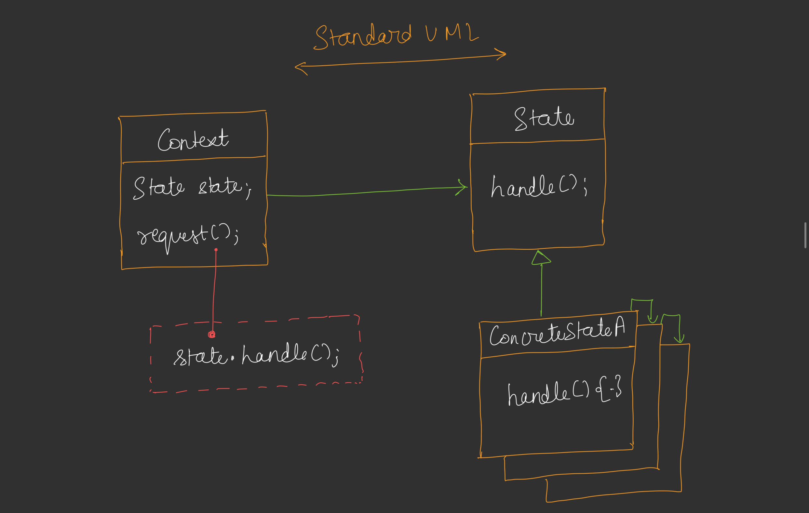
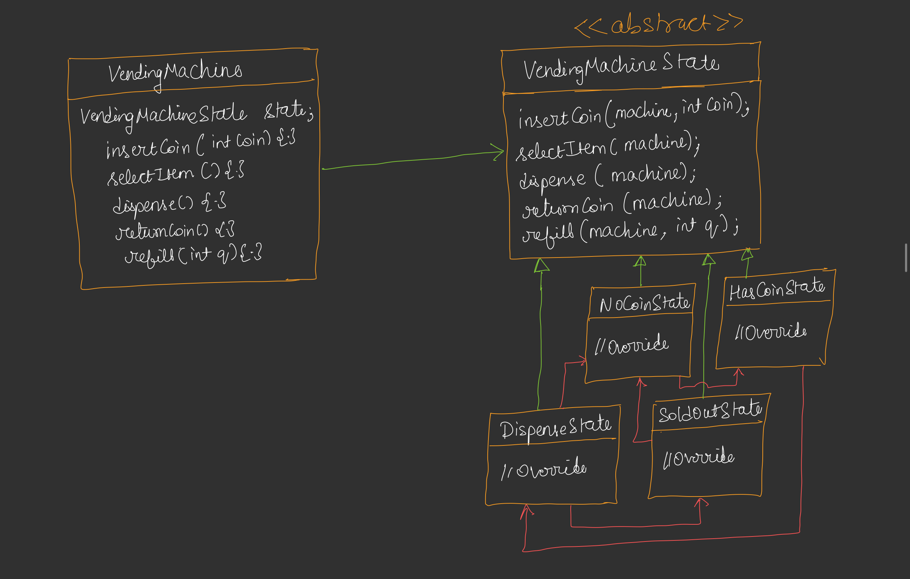
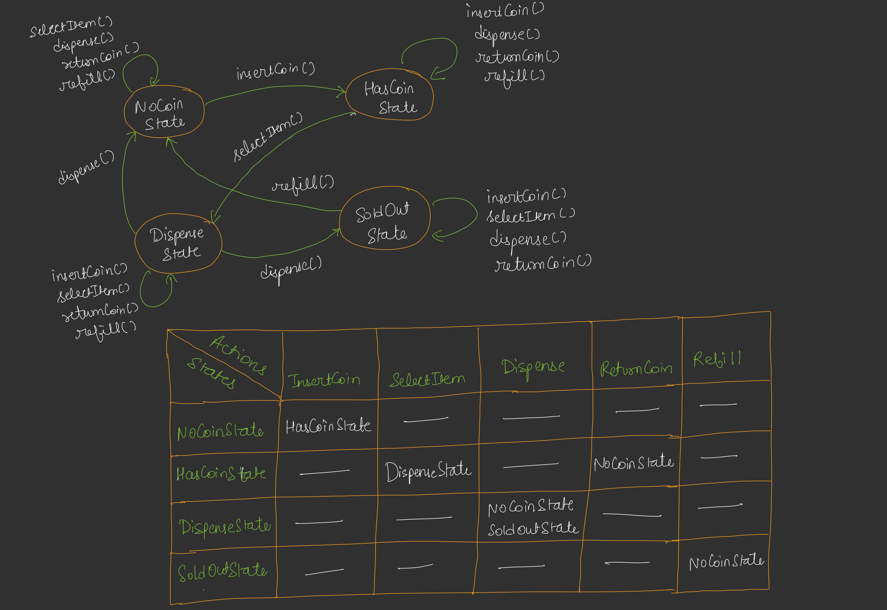

# State Design Pattern with Vending Machine Example

## Overview
The State Design Pattern is a behavioral design pattern that allows an object to alter its behavior when its internal state changes. The pattern encapsulates each state into a separate class, enabling the object to switch states dynamically and execute state-specific behavior.

## Purpose
- Manage state-dependent behavior without using numerous conditional statements.
- Enable easy addition of new states without modifying existing code (Open/Closed Principle).
- Provide a clean way to handle complex state transitions.

## Components
1. **Context (VendingMachine)**: Maintains a reference to the current state and delegates requests to it.
2. **State Interface (VendingState)**: Defines methods for state-specific behavior (e.g., `insertCoin`, `selectItem`).
3. **Concrete States (NoCoinState, HasCoinState, DispenseState, SoldOutState)**: Implement the state interface to handle specific behaviors and state transitions.

## Implementation [Code](/system-design/32/VendingMachineMain.java)
The provided Java code implements the State pattern for a vending machine with the following states:
- **NoCoinState**: Initial state where no coin is inserted.
- **HasCoinState**: State after a coin is inserted, allowing item selection.
- **DispenseState**: State during item dispensing.
- **SoldOutState**: State when no items are available.

### Key Features
- **VendingMachine**: Acts as the context, managing the current state and item/coin data.
- **State Transitions**: 
  - `NoCoinState` → `HasCoinState` on coin insertion.
  - `HasCoinState` → `DispenseState` on valid item selection.
  - `DispenseState` → `NoCoinState` or `SoldOutState` after dispensing.
  - `SoldOutState` → `NoCoinState` on refill.
- **Behavior**: Each state handles operations like coin insertion, item selection, dispensing, and refilling differently.

## Example Usage
The `VendingMachineMain` class demonstrates the pattern:
1. Initializes a vending machine with 2 items priced at Rs 20.
2. Tests state transitions:
   - Selects item without coin (stays in `NoCoinState`).
   - Inserts Rs 10 (moves to `HasCoinState`).
   - Adds Rs 10, selects item, and dispenses (moves to `DispenseState` then `NoCoinState`).
   - Buys the last item, leading to `SoldOutState`.
   - Refills to return to `NoCoinState`.

## Benefits
- **Flexibility**: Easy to add new states (e.g., `MaintenanceState`) without altering existing code.
- **Clarity**: State-specific logic is encapsulated, reducing conditional complexity.
- **Maintainability**: State transitions are explicit and manageable.

## Limitations
- Increases the number of classes, potentially adding complexity for simple state machines.
- Requires careful state transition logic to avoid invalid states.

## Use Cases
- Vending machines, traffic lights, or any system with state-dependent behavior.
- Workflows where the system’s behavior changes based on its current condition.

## Conclusion
The State pattern effectively models the vending machine's behavior, allowing seamless state changes and clear separation of concerns. The example showcases its practical application in managing a real-world scenario.
